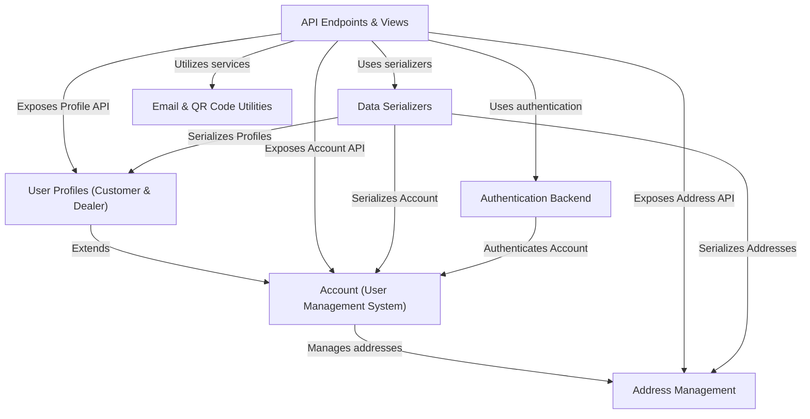
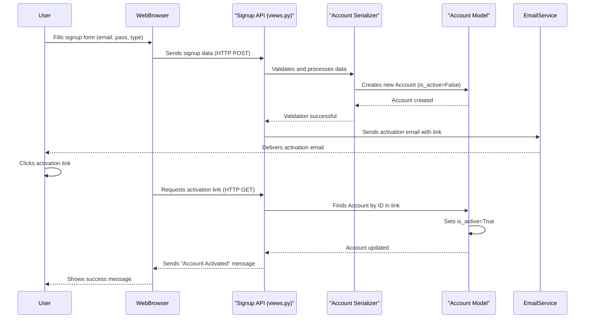
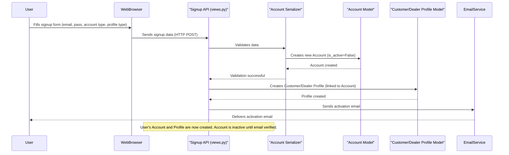
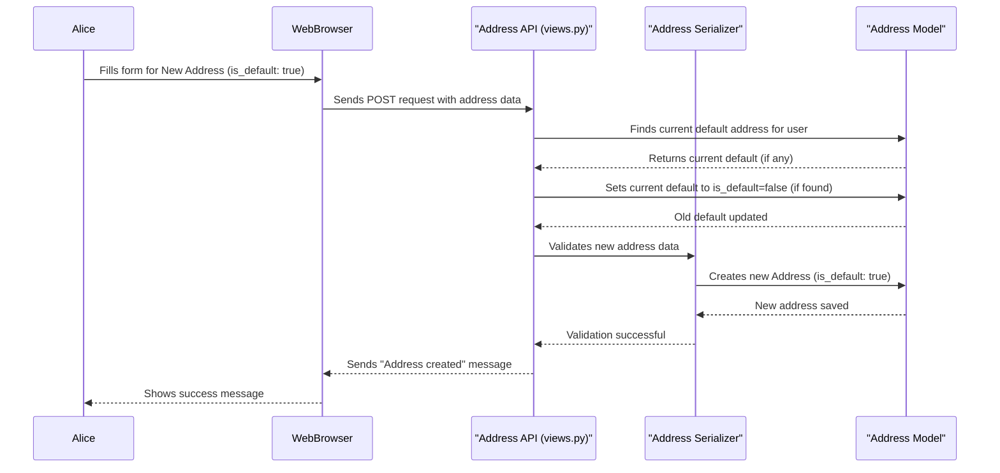
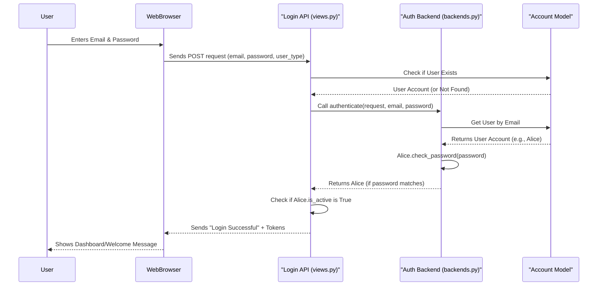
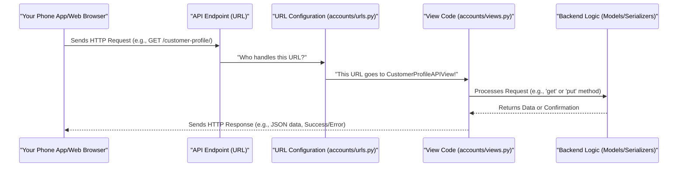
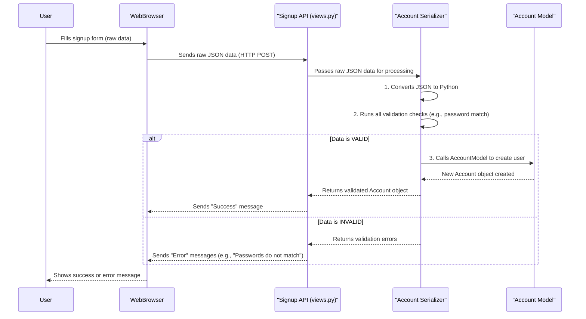
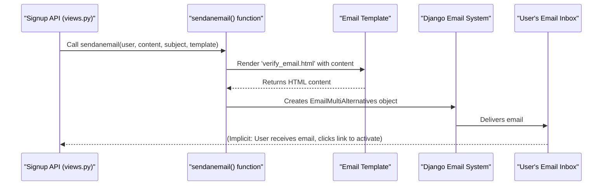
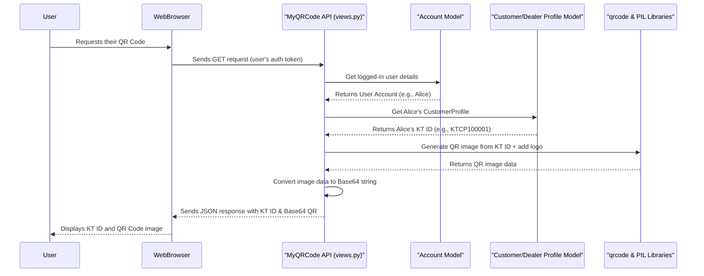

# Tutorial: document_KT

The `document_KT` project is a robust backend system primarily focused on **user management**. It provides a comprehensive framework for creating and managing different types of users, specifically *customers* and *dealers*, each with specialized profiles. The system handles **secure user authentication**, enables users to manage their physical **addresses**, and includes utility functions for sending *emails* and generating unique *QR codes* for identification.


## Visual Overview



## Chapters

1. [Account (User Management System)
](01_account__user_management_system__.md)
2. [User Profiles (Customer & Dealer)
](02_user_profiles__customer___dealer__.md)
3. [Address Management
](03_address_management_.md)
4. [Authentication Backend
](04_authentication_backend_.md)
5. [API Endpoints & Views
](05_api_endpoints___views_.md)
6. [Data Serializers
](06_data_serializers_.md)
7. [Email & QR Code Utilities
](07_email___qr_code_utilities_.md)

---

<sub><sup>Generated by [AI Codebase Knowledge Builder](https://github.com/The-Pocket/Tutorial-Codebase-Knowledge).</sup></sub>

# Chapter 1: Account (User Management System)

Every big website or application needs to know who is using it. Think about your email, social media, or online shopping accounts. How do these platforms recognize you? How do they know what you're allowed to do? This is precisely the problem that the "Account" system in our project solves!

Imagine our project, `document_KT`, as a bustling marketplace. We'll have **Customers** who want to find services and **Dealers** who provide them. To keep things organized and secure, we need a way to identify each person uniquely. That's the main job of an "Account".

The `Account` is like your "master ID card" or "passport" for the entire platform. It holds your fundamental identity (like your email and name) and basic access rights. Without an Account, you can't really do much on the platform, just like you can't board an international flight without a passport!

Let's consider a common scenario: **A new customer wants to sign up for our platform.** How does this process work with the Account system?

### What is an Account?

At its simplest, an `Account` is a record that represents a unique user on our platform. It contains:

*   **Your Identity:** Your email address (which is unique to you) and your full name.
*   **Your Secret Key:** Your password, kept safe and secure.
*   **Your Role:** Are you a `Customer` or a `Dealer`? This helps the system know what features you should see and use.
*   **Status Information:** Is your account active? Are you logged in right now? Are you an administrator?

### Signing Up: Creating Your Master ID Card

When a new customer signs up, they're essentially asking the system to create their unique `Account`. Here's how it generally happens:

1.  **You provide your details:** You fill out a form with your email, full name, a password, and indicate that you're signing up as a 'Customer'.
2.  **The System Processes It:** Our system takes this information and creates a new `Account` record.
3.  **Activation Email:** To make sure it's really you, the system sends an activation link to your email.
4.  **You Activate:** You click the link in the email, and your `Account` becomes active, allowing you to log in.

Let's look at a simplified code example of how someone might send their signup details to our system (this is what happens when you click "Submit" on a signup form):

```python
# This is what your web browser might send to the system
signup_data = {
    "full_name": "Alice Wonderland",
    "email": "alice@example.com",
    "password": "strongpassword123",
    "password2": "strongpassword123", # Confirm password
    "account_type": "Customer",
    "profile_type": "Personal" # More details for the profile
}

# Imagine this data being sent to our system's signup "door"
# The system will then process it.
print("Sending signup data to the system...")
```
After receiving this data, our system will begin creating the `Account` for Alice.

### Under the Hood: Building Your Account

Let's peek behind the curtain to see how the "Account" system is built using Django, a popular web framework for Python.

#### 1. The Account Blueprint (`accounts/models.py`)

The most fundamental part of our Account system is the `Account` model. Think of this as the blueprint that defines what information every `Account` must have. It's defined in the `accounts/models.py` file.

```python
# Simplified from accounts/models.py

from django.db import models
from django.contrib.auth.models import AbstractBaseUser, PermissionsMixin

class MyAccountManager(models.BaseUserManager):
    # This part helps create users and superusers (admins)
    def create_user(self, full_name, email, password=None, **extra_fields):
        # Checks if email exists, normalizes it, and creates the user.
        # It securely stores the password (not shown here fully).
        # ... (full implementation is longer) ...
        pass

class Account(AbstractBaseUser, PermissionsMixin):
    account_type_choice =(
        ('Customer','Customer'),
        ('Dealer','Dealer'),
    )
    full_name = models.CharField(max_length=100)
    email = models.EmailField(max_length=100,unique=True)
    phone_number = models.CharField(max_length=13,null=True,blank=True)
    account_type = models.CharField(choices=account_type_choice,max_length=30,null=True,blank=True)
    
    # ... other fields like date_joined, is_active, is_staff, etc. ...
    
    USERNAME_FIELD = 'email' # We use email to log in
    REQUIRED_FIELDS = ['full_name'] # What's needed to create a user
    
    objects = MyAccountManager() # Our special helper for managing accounts
    
    def __str__(self):
        return self.email
```
In this code:
*   `Account` is our "blueprint." It inherits from `AbstractBaseUser` and `PermissionsMixin`, which gives it built-in features for user authentication and permissions.
*   `email` is set as `unique=True` because every user must have a different email address, just like every person has a unique passport number.
*   `account_type` uses `choices` to ensure an account can only be 'Customer' or 'Dealer'.
*   `MyAccountManager` is a special class that knows how to create new `Account` objects securely, especially handling passwords.

#### 2. The Account Manager (`MyAccountManager` in `accounts/models.py`)

The `MyAccountManager` handles the complex steps of creating new users and making sure their passwords are saved safely (not in plain text!). When we say `Account.objects.create_user(...)`, it's this manager that does the work. It's like the specialized construction crew that follows the `Account` blueprint to build a new account.

#### 3. Admin's Control Panel (`accounts/admin.py`)

For administrators of the platform, Django provides a powerful admin interface. The `AccountAdmin` class makes sure that administrators can easily view, create, and modify user accounts through this interface.

```python
# Simplified from accounts/admin.py

from django.contrib import admin
from .models import Account
from django.contrib.auth.admin import UserAdmin

@admin.register(Account)
class AccountAdmin(UserAdmin):
    model = Account
    list_display = ('email', 'full_name', 'account_role','account_type','is_staff', 'is_active',)
    list_filter = ('is_staff', 'is_active','email')
    fieldsets = (
        (None, {'fields': ('email', 'password')}),
        ('Personal Info', {'fields': ('full_name',)}),
        ('Permissions', {'fields': ('is_staff', 'is_active', 'is_superuser',)}),
    )
    # ... (other admin configurations) ...
```
This code tells Django how to display `Account` information in the admin panel, making it easy for platform administrators to manage users.

#### 4. The Signup "Door" (`accounts/views.py`)

When you sign up on the website, your details are sent to a special "door" in our system, known as an API endpoint. For signups, this is handled by the `SignupAPIView` in `accounts/views.py`.

```python
# Simplified from accounts/views.py

from rest_framework.views import APIView
from rest_framework.response import Response
from rest_framework import status
from .serializers import AccountSerializer
from .models import Account

class SignupAPIView(APIView):
    def post(self, request):
        email = request.data.get("email")
        if Account.objects.filter(email=email).first():
            return Response({"error": "User already exists"}, status=status.HTTP_400_BAD_REQUEST)
            
        serializer = AccountSerializer(data=request.data)
        if serializer.is_valid(raise_exception=True):
            user = serializer.save() # This creates the Account
            user.is_active = False # New accounts are inactive initially
            user.save()
            # ... (code to send activation email) ...
            return Response({"message": "Registration successful. Activation link sent."}, status=status.HTTP_201_CREATED)
        return Response(serializer.errors, status=status.HTTP_400_BAD_REQUEST)
```
This is the code that receives your signup data. It first checks if the email already exists. Then, it uses something called an `AccountSerializer` (explained next) to check your data and then saves your new `Account` to the database. Notice how `user.is_active = False` is set, meaning the account isn't ready to use until activated.

#### 5. The Data Translator (`accounts/serializers.py`)

Before saving your signup data, the system needs to make sure it's correct and safe. This is where `AccountSerializer` in `accounts/serializers.py` comes in. It acts like a strict validator and translator.

```python
# Simplified from accounts/serializers.py

from rest_framework import serializers
from .models import Account

class AccountSerializer(serializers.ModelSerializer):
    password2 = serializers.CharField(write_only=True) # For confirming password

    class Meta:
        model = Account
        fields = ['full_name', 'email', 'phone_number', 'password', 'password2', 'account_type']
        extra_kwargs = {'password': {'write_only': True}} # Don't show password in responses

    def validate(self, attrs):
        if attrs['password'] != attrs['password2']:
            raise serializers.ValidationError("Passwords do not match")
        return attrs

    def create(self, validated_data):
        # This calls the create_user method from MyAccountManager
        validated_data.pop('password2') # Remove password2 before creating
        # 'profile_type' is handled in the view logic, not directly by Account here
        validated_data.pop('profile_type') 
        return Account.objects.create_user(**validated_data)
```
The `AccountSerializer` ensures:
*   All required fields are present.
*   The email format is correct.
*   Crucially, `password` and `password2` (confirm password) match.
Once validated, it calls the `create_user` method of our `MyAccountManager` to safely create the `Account`.

#### 6. Account Activation Flow

After a user signs up, their `Account` is initially marked as `is_active = False`. This means they can't log in yet. The system then sends an activation email with a unique link. When the user clicks this link, it calls the `ActivateAccountAPIView` in `accounts/views.py`. This view checks the link's validity and, if everything is correct, sets `user.is_active = True`. Only then can the user log in. This is a common security measure to verify email addresses and prevent bots from creating fake accounts.

#### Sequence Diagram: How Signup Works

Let's visualize the steps when a user signs up and activates their account:



This diagram shows the journey from a user filling out a form to their account becoming active. Notice how `AccountSerializer` and `AccountModel` work together, and how the `SignupAPI` coordinates the process, including sending the activation email.

### Conclusion

In this chapter, we learned that the `Account` is the fundamental building block for identifying users in our `document_KT` project. It's like the "master ID card" holding essential details and determining basic access. We saw how new accounts are created through a signup process involving the `Account` model, a manager, a serializer for validation, and an activation step to ensure security.

However, an `Account` only provides basic information (email, name, role). What if we need more specific details for a `Customer` (like a profile picture) or a `Dealer` (like their business type)? That's where **User Profiles** come in, which we'll explore in the next chapter.

[User Profiles (Customer & Dealer)](02_user_profiles__customer___dealer__.md)

---

<sub><sup>Generated by [AI Codebase Knowledge Builder](https://github.com/The-Pocket/Tutorial-Codebase-Knowledge).</sup></sub> <sub><sup>**References**: [[1]](https://github.com/snehabansal483/document_KT/blob/d67e31b38bb840bb7638be252701f22660c34d80/accounts/admin.py), [[2]](https://github.com/snehabansal483/document_KT/blob/d67e31b38bb840bb7638be252701f22660c34d80/accounts/backends.py), [[3]](https://github.com/snehabansal483/document_KT/blob/d67e31b38bb840bb7638be252701f22660c34d80/accounts/migrations/0001_initial.py), [[4]](https://github.com/snehabansal483/document_KT/blob/d67e31b38bb840bb7638be252701f22660c34d80/accounts/models.py), [[5]](https://github.com/snehabansal483/document_KT/blob/d67e31b38bb840bb7638be252701f22660c34d80/accounts/serializers.py), [[6]](https://github.com/snehabansal483/document_KT/blob/d67e31b38bb840bb7638be252701f22660c34d80/accounts/views.py)</sup></sub>


# Chapter 2: User Profiles (Customer & Dealer)

In [Chapter 1: Account (User Management System)](01_account__user_management_system__.md), we learned that an `Account` is like your "master ID card" for the `document_KT` platform. It holds your basic identity (email, name) and tells the system if you're a `Customer` or a `Dealer`. But what if we need more specific details?

Imagine you're signing up as a `Customer` on an online shopping site. Beyond your basic account, you might want to add a profile picture, or mark your profile as "personal" or for an "organization." Or, if you're a `Dealer` (like a business selling goods), you might need to specify if you're a 'Kabadi' (scrap dealer), a 'Collector', or a 'Recycler'.

This is where **User Profiles** come in! User Profiles are like "role-specific badges" that attach extra, specialized information to your basic `Account`. They help define your particular role and store data unique to that role within the system.

### What are User Profiles?

In `document_KT`, we have two main types of specialized profiles:

1.  **CustomerProfile:** This badge is for `Customer` accounts. It holds information that's only relevant to customers.
2.  **DealerProfile:** This badge is for `Dealer` accounts. It holds information specific to different types of dealers.

Think of it this way: Your `Account` is your name and basic ID. Your `CustomerProfile` or `DealerProfile` is like having a specific job title or a special membership card that gives you additional features and identifies your specific type of activity on the platform.

Each profile is uniquely linked to one `Account`. So, one `Account` can only have *either* a `CustomerProfile` *or* a `DealerProfile`, never both.

Let's look at the key details these profiles store:

| Feature      | CustomerProfile                                      | DealerProfile                                      |
| :----------- | :--------------------------------------------------- | :------------------------------------------------- |
| **KT ID**    | `kt_id` (e.g., `KTCP100001` for Personal Customer) | `kt_id` (e.g., `KTDK100001` for Kabadi Dealer)     |
| **Profile Type** | `Personal` or `Organization`                         | `Kabadi`, `Collector`, or `Recycler`               |
| **Profile Pic**| Stores an image for the user's profile picture       | Stores an image for the dealer's profile picture   |
| **QR Code**  | An auto-generated QR code linked to the `kt_id`      | An auto-generated QR code linked to the `kt_id`    |

The `kt_id` is especially important as it's a unique identifier specific to our `document_KT` system, giving each customer or dealer a distinct ID beyond their email.

### Use Case: A User Signs Up and Creates a Profile

When you sign up as a `Customer` or `Dealer` (as we saw in Chapter 1), our system doesn't just create your basic `Account`. It also automatically creates the correct profile (`CustomerProfile` or `DealerProfile`) for you and links it to your `Account`.

Let's say Alice (a `Customer`) and Bob (a `Dealer`) sign up:

1.  **Alice signs up as a 'Customer' with 'Personal' profile type.**
    *   The system creates her `Account` (from Chapter 1).
    *   Then, it automatically creates a `CustomerProfile` for her, linked to her `Account`, and sets her `profile_type` to 'Personal'. It also generates her `kt_id` and `qrCode`.

2.  **Bob signs up as a 'Dealer' with 'Kabadi' profile type.**
    *   The system creates his `Account`.
    *   Then, it automatically creates a `DealerProfile` for him, linked to his `Account`, and sets his `profile_type` to 'Kabadi'. It also generates his `kt_id` and `qrCode`.

After signup, users can also update their profile details, like adding or changing their `ProfilePic`.

Here's how you might send data to update a customer's profile picture:

```python
# This is what your web browser might send to the system
# Imagine 'new_profile_pic.jpg' is an image file
profile_data = {
    "ProfilePic": "new_profile_pic.jpg"
}

# This data would be sent to an API endpoint like /api/customer/profile/
print("Sending profile picture update data...")
```
When this data is received, the system updates Alice's `CustomerProfile` with the new image.

### Under the Hood: Building User Profiles

Let's look at how these profiles are structured and managed within our Django project.

#### 1. The Profile Blueprints (`accounts/models.py`)

Just like the `Account` model, we have blueprints for `CustomerProfile` and `DealerProfile` in `accounts/models.py`.

```python
# Simplified from accounts/models.py
from django.db import models
from .models import Account # Assuming Account is defined earlier

class CustomerProfile(models.Model):
    profile_type_choice = (
        ('Personal', 'Personal'),
        ('Organization', 'Organization'),
    )
    kt_id = models.CharField(max_length=20, editable=False)
    profile_type = models.CharField(max_length=20, choices=profile_type_choice, default='Personal')
    auth_id = models.OneToOneField(Account, on_delete=models.CASCADE, verbose_name="User")
    ProfilePic = models.ImageField(upload_to='media/accounts/Customer/')
    qrCode = models.ImageField(default = 'cvm_qrcodes/4.jpg', upload_to='media/accounts/Customer/QRs')

    def save(self, *args, **kwargs):
        # Logic to auto-generate kt_id based on profile_type
        if not self.kt_id or self.kt_id == 'KT':
            prefix = "KTCP" if self.profile_type == "Personal" else "KTCO"
            self.kt_id = f"{prefix}{100000 + CustomerProfile.objects.count() + 1}"
        super().save(*args, **kwargs)

class DealerProfile(models.Model):
    profile_type_choice = (
        ('Kabadi', 'Kabadi'),
        ('Collector', 'Collector'),
        ('Recycler', 'Recycler'),
    )
    kt_id = models.CharField(max_length=20, editable=False)
    profile_type = models.CharField(max_length=20, choices=profile_type_choice, default='Kabadi')
    auth_id = models.OneToOneField(Account,on_delete=models.CASCADE,null=True)
    qrCode = models.ImageField(default = 'cvm_qrcodes/4.jpg', upload_to='accounts/Dealer/QRs')
    ProfilePic = models.ImageField(default = 'photos/Profile_Pic.png', upload_to='accounts/Dealer/ProfilePic', null = True, blank = True)

    def save(self, *args, **kwargs):
        # Logic to auto-generate kt_id based on profile_type
        if not self.kt_id or self.kt_id == 'KT':
            if self.profile_type == "Kabadi": prefix = "KTDK"
            elif self.profile_type == "Collector": prefix = "KTDC"
            else: prefix = "KTDR"
            self.kt_id = f"{prefix}{100000 + DealerProfile.objects.count() + 1}"
        super().save(*args, **kwargs)
```
In these blueprints:
*   `auth_id = models.OneToOneField(Account, ...)` is crucial. It means each profile is directly and exclusively linked to one `Account`, and vice-versa. If the `Account` is deleted, the profile is also deleted (`on_delete=models.CASCADE`).
*   `kt_id` is `editable=False`, meaning the system generates it automatically when the profile is saved.
*   `profile_type` uses `choices` to ensure only specific types can be selected.
*   `ProfilePic` and `qrCode` are fields for image files.
*   The `save()` method contains logic to automatically generate the `kt_id` based on the `profile_type`.

#### 2. Admin's View (`accounts/admin.py`)

Administrators can easily manage these profiles through Django's admin interface:

```python
# Simplified from accounts/admin.py
from django.contrib import admin
from .models import CustomerProfile, DealerProfile

@admin.register(CustomerProfile)
class CustomerProfileAdmin(admin.ModelAdmin):
    list_display = ('id', 'auth_id','ProfilePic','qrCode')
    list_filter = ('auth_id','profile_type')

@admin.register(DealerProfile)
class DealerProfileAdmin(admin.ModelAdmin):
    list_display = ('id', 'auth_id','ProfilePic','qrCode')
    list_filter = ('profile_type',)
```
This code tells Django how to display `CustomerProfile` and `DealerProfile` records in the admin panel, making it easy to search and filter them.

#### 3. The Data Translators (`accounts/serializers.py`)

When data comes into or goes out of our system for profiles, it needs to be validated and formatted. `CustomerProfileSerializer` and `DealerProfileSerializer` handle this.

```python
# Simplified from accounts/serializers.py
from rest_framework import serializers
from .models import CustomerProfile, DealerProfile

class CustomerProfileSerializer(serializers.ModelSerializer):
    class Meta:
        model = CustomerProfile
        fields = ['ProfilePic'] # Only ProfilePic is directly settable via API
        read_only_fields = ['qrCode'] # qrCode is auto-generated

    def validate(self, attrs):
        # Ensures that only a 'Customer' account can create/update this profile
        user = self.context['auth_id']
        if user.account_type != 'Customer':
            raise serializers.ValidationError("Only Customers can manage CustomerProfile.")
        return attrs

    def create(self, validated_data):
        auth_id = self.context.get('auth_id')
        return CustomerProfile.objects.create(auth_id=auth_id, **validated_data)

class DealerProfileSerializer(serializers.ModelSerializer):
    class Meta:
        model = DealerProfile
        fields = ['ProfilePic']
        read_only_fields = ['auth_id'] # auth_id should not be directly editable
        # 'qrCode' and 'kt_id' are also read-only, but often implicit or set in views

    def validate(self, attrs):
        # Ensures that only a 'Dealer' account can create/update this profile
        user = self.context['auth_id']
        if user.account_type != 'Dealer':
            raise serializers.ValidationError("Only Dealers can manage DealerProfile.")
        return attrs

    def create(self, validated_data):
        auth_id = self.context['auth_id']
        validated_data['auth_id'] = auth_id
        return DealerProfile.objects.create(**validated_data)
```
These serializers define which fields can be sent or received. They also include `validate` methods to ensure that, for example, a `CustomerProfile` is only created or updated by an actual `Customer` account. The `create` method links the profile to the correct authenticated user (`auth_id`).

#### 4. The Profile "Doors" (`accounts/views.py`)

When you interact with profiles through the website or app, your requests go to specific API endpoints, handled by views in `accounts/views.py`.

**Creating Profiles During Signup:**
As mentioned, the initial creation of `CustomerProfile` or `DealerProfile` happens right after the `Account` is created in the `SignupAPIView` from Chapter 1.

```python
# Simplified from accounts/views.py - part of SignupAPIView
class SignupAPIView(APIView):
    def post(self, request):
        # ... (email, password validation as in Chapter 1) ...
        if serializer.is_valid(raise_exception=True):
            user = serializer.save() # This creates the Account
            user.is_active = False
            # ... (send activation email) ...

            account_type = request.data.get("account_type")
            profile_type = request.data.get("profile_type")

            if account_type == 'Customer':
                CustomerProfile.objects.get_or_create(auth_id=user, defaults={"profile_type": profile_type})
            else: # account_type == 'Dealer'
                DealerProfile.objects.get_or_create(auth_id=user, defaults={"profile_type": profile_type})

            return Response({"message": "Registration successful..."}, status=status.HTTP_201_CREATED)
        # ... (error handling) ...
```
This snippet shows how the `SignupAPIView` checks the `account_type` and `profile_type` from the signup data and then either creates a `CustomerProfile` or `DealerProfile`, linking it to the newly created `user` (Account).

**Viewing and Updating Profiles:**
Separate API views exist for logged-in users to `GET` (retrieve) their profile information or `PUT` (update) parts of it, like a profile picture.

```python
# Simplified from accounts/views.py
from rest_framework.views import APIView
from rest_framework.response import Response
from rest_framework.permissions import IsAuthenticated
from .models import CustomerProfile, DealerProfile
from .serializers import CustomerProfileSerializer, DealerProfileSerializer
from rest_framework.parsers import MultiPartParser, FormParser

class CustomerProfileAPIView(APIView):
    permission_classes = [IsAuthenticated]
    parser_classes = [MultiPartParser, FormParser] # Allows sending files like images

    def get(self, request):
        try:
            # Get the customer profile linked to the currently logged-in user
            customer_profile = CustomerProfile.objects.get(auth_id=request.user)
            serializer = CustomerProfileSerializer(customer_profile)
            return Response(serializer.data, status=status.HTTP_200_OK)
        except CustomerProfile.DoesNotExist:
            return Response({"error": "Customer profile not found"}, status=status.HTTP_404_NOT_FOUND)

    def put(self, request):
        try:
            customer_profile = CustomerProfile.objects.get(auth_id=request.user)
            # Update the profile with data from the request
            serializer = CustomerProfileSerializer(
                customer_profile, data=request.data, partial=True, context={'auth_id': request.user}
            )
            if serializer.is_valid(raise_exception=True):
                serializer.save()
                return Response({"message": "Customer profile updated successfully"}, status=status.HTTP_200_OK)
            return Response(serializer.errors, status=status.HTTP_400_BAD_REQUEST)
        except CustomerProfile.DoesNotExist:
            return Response({"error": "Customer profile not found"}, status=status.HTTP_404_NOT_FOUND)

# DealerProfileAPIView would be similar, but for DealerProfile model and serializer
```
This `CustomerProfileAPIView` allows a logged-in `Customer` to retrieve their profile details (`GET`) and update their `ProfilePic` (`PUT`). The `MultiPartParser` and `FormParser` are necessary to handle image file uploads.

#### Sequence Diagram: Profile Creation during Signup

Let's visualize how the `Account` and its related `Profile` are created when a user signs up:



This diagram illustrates the integrated process where a new user's `Account` and their specific `CustomerProfile` or `DealerProfile` are both set up during the initial signup flow.

### Conclusion

User Profiles are essential for adding specific details beyond a user's basic `Account`. By having `CustomerProfile` and `DealerProfile` models, our `document_KT` project can store unique information like `kt_id`, `profile_type`, `ProfilePic`, and `qrCode` for different user types. This modular approach keeps our data organized and ensures that each user's experience is tailored to their specific role.

Now that we understand how user accounts and profiles are managed, the next step is to explore how to handle their physical locations.

[Address Management](03_address_management_.md)

---

<sub><sup>Generated by [AI Codebase Knowledge Builder](https://github.com/The-Pocket/Tutorial-Codebase-Knowledge).</sup></sub> <sub><sup>**References**: [[1]](https://github.com/snehabansal483/document_KT/blob/d67e31b38bb840bb7638be252701f22660c34d80/accounts/admin.py), [[2]](https://github.com/snehabansal483/document_KT/blob/d67e31b38bb840bb7638be252701f22660c34d80/accounts/migrations/0001_initial.py), [[3]](https://github.com/snehabansal483/document_KT/blob/d67e31b38bb840bb7638be252701f22660c34d80/accounts/models.py), [[4]](https://github.com/snehabansal483/document_KT/blob/d67e31b38bb840bb7638be252701f22660c34d80/accounts/serializers.py), [[5]](https://github.com/snehabansal483/document_KT/blob/d67e31b38bb840bb7638be252701f22660c34d80/accounts/views.py)</sup></sub>


# Chapter 3: Address Management

In [Chapter 1: Account (User Management System)](01_account__user_management_system__.md), we established the `Account` as your digital identity card. Then, in [Chapter 2: User Profiles (Customer & Dealer)](02_user_profiles__customer___dealer__.md), we added specific "badges" like `CustomerProfile` or `DealerProfile` to store details unique to your role. But what about where you *are*?

Imagine you're an online shopper, or a business that needs to send or receive goods. Where do you live? Where is your office? How does the system know where to deliver your purchases or send important documents? This is exactly what **Address Management** handles in our `document_KT` project!

It's like having a "digital address book" connected to your account. You can store all your important locations – your home, your office, your vacation rental, or even a friend's address for a gift delivery. The system keeps track of them, and you can easily pick one as your main or "default" address.

### What is an Address?

In `document_KT`, an `Address` is a record that stores all the necessary information about a physical location. Each `Address` is linked to a specific `Account`, meaning every user can have one or more addresses saved under their name.

Here's what an `Address` typically contains:

| Field Name     | Description                                               | Example                         |
| :------------- | :-------------------------------------------------------- | :------------------------------ |
| `add_user`     | Which user (Account) does this address belong to?         | Alice's Account                 |
| `add_line1`    | The primary street address.                               | `123 Main Street`               |
| `add_line2`    | Optional, secondary address information (e.g., apartment).| `Apt 4B`                        |
| `landmark`     | A nearby recognizable place.                              | `Near City Park`                |
| `city`         | The city.                                                 | `Springfield`                   |
| `state`        | The state or province.                                    | `IL`                            |
| `country`      | The country.                                              | `USA`                           |
| `zipcode`      | The postal code.                                          | `62704`                         |
| `is_default`   | Is this the user's primary/default address? (Yes/No)      | `True`                          |

The `is_default` field is very handy! It means you can have several addresses, but one is always marked as the one you use most often. When you set a new address as default, any previous default address for your account automatically becomes non-default. This ensures you always have one main address.

### Use Case: Managing Your Addresses

Let's say Alice (our `Customer`) has moved homes. She needs to add her new address and set it as her default. She might also want to keep her old address in her account for a while, just in case.

Here’s how Alice might add her new address and set it as default:

1.  **Alice logs into her account.**
2.  **She goes to her "My Addresses" section.**
3.  **She clicks "Add New Address" and fills in the details.** She makes sure to tick the "Set as default" box for her new address.
4.  **She clicks "Save."**

The system will then:
*   Save her new address.
*   Automatically change her *previous* default address to be *not* default.
*   Mark her *new* address as the default one.

Alice can also edit an existing address or delete one she no longer needs.

Here’s a simplified example of the data Alice's web browser might send to the system to add a new default address:

```python
# This is what your web browser might send to the system
new_address_data = {
    "add_line1": "456 Elm Avenue",
    "add_line2": "",
    "landmark": "Next to the bookstore",
    "city": "Springfield",
    "state": "IL",
    "country": "USA",
    "zipcode": 62705,
    "is_default": True # This is important!
}

# Imagine this data being sent to our system's address "door"
print("Sending new default address data...")
```
When this data is received, the system processes it to store the address and manage the default flag.

### Under the Hood: Building Address Management

Let's see how the `Address` system is built and how it handles multiple addresses and the default feature.

#### 1. The Address Blueprint (`accounts/models.py`)

The core of our Address system is the `Address` model, defined in the `accounts/models.py` file. This is the blueprint for every address record.

```python
# Simplified from accounts/models.py

from django.db import models
from .models import Account # Assuming Account is defined earlier

class Address(models.Model):
    add_user = models.ForeignKey(Account, related_name='user_address', on_delete=models.CASCADE)
    add_line1 = models.CharField(max_length=200, verbose_name="Address Line 1")
    add_line2 = models.CharField(max_length=200, verbose_name="Address Line 2", blank=True)
    city = models.CharField(max_length=50, verbose_name="City")
    state = models.CharField(max_length=50, verbose_name="State")
    country = models.CharField(max_length=50, verbose_name="Country")
    zipcode = models.IntegerField(verbose_name="Zipcode")
    is_default = models.BooleanField(default=False, verbose_name="Default Address")
    
    def __str__(self):
        return f"{self.add_line1}, {self.city}"

    class Meta:
        verbose_name = "Address"
        verbose_name_plural = "Addresses"
```
In this code:
*   `add_user = models.ForeignKey(Account, ...)` is key. It creates a link from the `Address` back to the `Account` it belongs to. `ForeignKey` means one user can have many addresses. `on_delete=models.CASCADE` means if a user's `Account` is deleted, all their addresses are also deleted.
*   `is_default = models.BooleanField(default=False)` is the flag that tells us if this is the user's main address.

#### 2. Admin's Control Panel (`accounts/admin.py`)

Just like with `Account` and `Profile` models, Django's admin interface allows platform administrators to view and manage addresses easily.

```python
# Simplified from accounts/admin.py

from django.contrib import admin
from .models import Address

@admin.register(Address)
class AddressAdmin(admin.ModelAdmin):
    list_display = ('id', 'add_user', 'add_line1', 'city', 'zipcode', 'is_default')
    list_filter = ('city', 'state', 'country', 'is_default')
    search_fields = ('add_line1', 'city', 'zipcode', 'add_user__email')
```
This tells Django how to display addresses in the admin panel, making it simple to find addresses by user, city, or check which ones are set as default.

#### 3. The Data Translator (`accounts/serializers.py`)

When you add or update an address, the `AddressSerializer` in `accounts/serializers.py` acts as a validator and translator, ensuring the data is correct before it's saved to the database.

```python
# Simplified from accounts/serializers.py

from rest_framework import serializers
from .models import Address

class AddressSerializer(serializers.ModelSerializer):
    class Meta:
        model = Address
        fields = [
            'id', 'add_user', 'add_line1', 'add_line2', 'landmark', 'city',
            'state', 'country', 'zipcode', 'is_default'
        ]
        read_only_fields = ['add_user', 'id'] # User ID and address ID are set by system

    def validate(self, attrs):
        # Ensure that the user adding/updating the address is authenticated
        if not self.context.get('add_user'):
            raise serializers.ValidationError("User login required.")
        return attrs

    def create(self, validated_data):
        # Link the address to the authenticated user
        add_user = self.context.get('add_user')
        return Address.objects.create(add_user=add_user, **validated_data)

    def update(self, instance, validated_data):
        # Update existing fields
        for field in ['add_line1', 'add_line2', 'landmark', 'city', 'state', 'country', 'zipcode', 'is_default']:
            setattr(instance, field, validated_data.get(field, getattr(instance, field)))
        instance.save()
        return instance
```
The `AddressSerializer` makes sure all required address fields are present and correctly formatted. The `read_only_fields` prevent users from directly changing the `add_user` or `id`. The `create` and `update` methods save the data, linking it to the logged-in user.

#### 4. The Address "Doors" (`accounts/views.py`)

When you interact with your addresses (adding, viewing, updating, deleting), your requests go to the `AddressAPIView` in `accounts/views.py`. This view handles the main logic for all address operations.

```python
# Simplified from accounts/views.py

from rest_framework.views import APIView
from rest_framework.response import Response
from rest_framework.permissions import IsAuthenticated
from .models import Address
from .serializers import AddressSerializer
from rest_framework import status

class AddressAPIView(APIView):
    permission_classes = [IsAuthenticated] # Only logged-in users can manage addresses

    def get(self, request, *args, **kwargs):
        # Get all addresses for the logged-in user
        addresses = Address.objects.filter(add_user=request.user)
        serializer = AddressSerializer(addresses, many=True) # `many=True` for multiple addresses
        return Response(serializer.data, status=status.HTTP_200_OK)

    def post(self, request, *args, **kwargs):
        user_instance = request.user
        is_default = request.data.get('is_default', False)

        if is_default:
            # If new address is default, make old defaults non-default
            Address.objects.filter(add_user=user_instance, is_default=True).update(is_default=False)

        serializer = AddressSerializer(data=request.data, context={'add_user': user_instance})
        if serializer.is_valid(raise_exception=True):
            serializer.save() # This creates the new address
            return Response({"message": "Address created successfully."}, status=status.HTTP_201_CREATED)
        return Response(serializer.errors, status=status.HTTP_400_BAD_REQUEST)

    def put(self, request, id, *args, **kwargs): # `id` is the address ID to update
        user_instance = request.user
        try:
            address = Address.objects.get(id=id, add_user=user_instance) # Find the specific address
        except Address.DoesNotExist:
            return Response({"error": "Address not found."}, status=status.HTTP_404_NOT_NOT_FOUND)

        is_default = request.data.get('is_default', False)
        if is_default:
            # If updating to default, make other addresses non-default
            Address.objects.filter(add_user=user_instance, is_default=True).exclude(id=address.id).update(is_default=False)

        serializer = AddressSerializer(address, data=request.data, partial=True, context={'add_user': user_instance})
        if serializer.is_valid(raise_exception=True):
            serializer.save() # This updates the address
            return Response({"message": "Address updated successfully."}, status=status.HTTP_200_OK)
        return Response(serializer.errors, status=status.HTTP_400_BAD_REQUEST)

    def delete(self, request, id, *args, **kwargs): # `id` is the address ID to delete
        try:
            address = Address.objects.get(id=id, add_user=request.user)
            address.delete()
            return Response({"message": "Address deleted successfully."}, status=status.HTTP_204_NO_CONTENT)
        except Address.DoesNotExist:
            return Response({"error": "Address not found."}, status=status.HTTP_404_NOT_FOUND)
```
This `AddressAPIView` is powerful!
*   `get`: Allows a user to fetch all their saved addresses.
*   `post`: Creates a new address. Notice the logic: if the new address is marked `is_default=True`, it first finds any *other* addresses for that user that were default and switches their `is_default` to `False`. This ensures only one default address exists per user.
*   `put`: Updates an existing address. It also contains logic to manage the `is_default` flag similar to `post`.
*   `delete`: Removes an address from the user's account.

#### Sequence Diagram: Adding a New Default Address

Let's visualize the steps when Alice adds a new address and sets it as her default:


This diagram shows how the system carefully manages the `is_default` flag to ensure a smooth user experience where only one address is primary at any given time.

### Conclusion

Address Management is crucial for any platform that deals with physical locations. In `document_KT`, we use the `Address` model to store location details, linked directly to user accounts. The system allows users to store multiple addresses and designates one as their `is_default`, with automatic handling to ensure consistency. This organized approach ensures that delivery and service information is always accurate and easy to manage for both customers and dealers.

Now that we understand how accounts, profiles, and addresses are managed, the next logical step is to explore how users securely gain access to these features.

[Authentication Backend](04_authentication_backend_.md)

---

<sub><sup>Generated by [AI Codebase Knowledge Builder](https://github.com/The-Pocket/Tutorial-Codebase-Knowledge).</sup></sub> <sub><sup>**References**: [[1]](https://github.com/snehabansal483/document_KT/blob/d67e31b38bb840bb7638be252701f22660c34d80/accounts/admin.py), [[2]](https://github.com/snehabansal483/document_KT/blob/d67e31b38bb840bb7638be252701f22660c34d80/accounts/migrations/0001_initial.py), [[3]](https://github.com/snehabansal483/document_KT/blob/d67e31b38bb840bb7638be252701f22660c34d80/accounts/migrations/0002_address_digipin.py), [[4]](https://github.com/snehabansal483/document_KT/blob/d67e31b38bb840bb7638be252701f22660c34d80/accounts/migrations/0003_remove_address_digipin.py), [[5]](https://github.com/snehabansal483/document_KT/blob/d67e31b38bb840bb7638be252701f22660c34d80/accounts/migrations/0004_address_digipin_code.py), [[6]](https://github.com/snehabansal483/document_KT/blob/d67e31b38bb840bb7638be252701f22660c34d80/accounts/migrations/0005_remove_address_digipin_code_address_digipin.py), [[7]](https://github.com/snehabansal483/document_KT/blob/d67e31b38bb840bb7638be252701f22660c34d80/accounts/migrations/0006_remove_address_digipin.py), [[8]](https://github.com/snehabansal483/document_KT/blob/d67e31b38bb840bb7638be252701f22660c34d80/accounts/models.py), [[9]](https://github.com/snehabansal483/document_KT/blob/d67e31b38bb840bb7638be252701f22660c34d80/accounts/serializers.py), [[10]](https://github.com/snehabansal483/document_KT/blob/d67e31b38bb840bb7638be252701f22660c34d80/accounts/views.py)</sup></sub>


# Chapter 4: Authentication Backend

In [Chapter 1: Account (User Management System)](01_account__user_management_system__.md), we learned about your "master ID card" – your `Account`. [Chapter 2: User Profiles (Customer & Dealer)](02_user_profiles__customer___dealer__.md) added specific "badges" for customers and dealers. And [Chapter 3: Address Management](03_address_management_.md) showed how to manage your locations. But there's a crucial question: How does our `document_KT` project know that the person trying to access all this information is *really* you?

Imagine you have a secret diary. You wouldn't leave it open for just anyone to read, right? You'd have a lock and key. Similarly, our `document_KT` platform needs a way to confirm your identity before letting you in to manage your account, profile, or addresses. This is exactly what the **Authentication Backend** does!

It's the "security guard" at the login gate. When you try to log in, it's the Authentication Backend's job to verify your identity. It takes the email and password you provide and checks them against the records stored in our system. If they match, it gives you the "all clear" to enter.

### What is an Authentication Backend?

In simple terms, an Authentication Backend is a set of rules and logic that tells our application *how* to verify a user's identity.

For our `document_KT` project, this component is specially configured to:

*   **Authenticate by Email:** Instead of a generic username, it uses your unique email address as your primary identifier.
*   **Verify Password:** It securely checks if the password you entered matches the one stored for your email.
*   **Grant Access:** If both match, it confirms your identity and lets you into your account.

Think of it as a highly trained security professional who knows exactly how to check your ID (email) and secret handshake (password) to ensure you're a valid member of the club.

### Use Case: Logging In to Your Account

Let's walk through the most common scenario: You want to log in to your `document_KT` account.

1.  **You open the `document_KT` website/app.**
2.  **You see a login screen** and type in your registered email and your password.
3.  **You click "Log In."**

Behind the scenes, the Authentication Backend springs into action. It takes your email and password, compares them with what's stored for your `Account` (from Chapter 1), and if they are correct, you're granted access! You'll then be able to see your customer or dealer profile, manage your addresses, and use all the features of the platform.

Here's how you might send your login details to the system:

```python
# This is what your web browser might send to the system
login_data = {
    "email": "alice@example.com",
    "password": "strongpassword123",
    "user_type": "Customer" # Or "Dealer"
}

# Imagine this data being sent to our system's login "door"
print("Sending login data to the system...")
```

If everything is correct, the system will send back a success message, along with special "tokens" that act like your temporary access pass for future actions on the site.

### Under the Hood: How Login Works

Let's peek behind the curtain to see how `document_KT` handles your login attempt.

#### 1. The Login "Door" (`accounts/views.py`)

When you click "Log In," your web browser sends your email and password to a specific "door" in our system, which is handled by the `LoginAccount` class in `accounts/views.py`.

```python
# Simplified from accounts/views.py - LoginAccount class
from django.contrib.auth import authenticate # The key helper!
from rest_framework.views import APIView
from rest_framework.response import Response
from rest_framework import status
from .models import Account # Our Account blueprint

class LoginAccount(APIView):
    def post(self, request):
        email = request.data.get("email")
        password = request.data.get("password")
        user_type = request.data.get("user_type")

        # 1. Does a user with this email exist?
        try:
            user = Account.objects.get(email=email)
        except Account.DoesNotExist:
            return Response({"message": "User doesn't exist"}, status=status.HTTP_401_UNAUTHORIZED)
        
        # 2. Is the user type correct?
        if user.account_type != user_type:
            return Response({"error": "Invalid user type."}, status=status.HTTP_401_UNAUTHORIZED)

        # 3. Ask the Authentication Backend to check credentials
        user = authenticate(request, email=email, password=password)
        
        if user is None:
            return Response({"error": "Invalid email or password."}, status=status.HTTP_401_UNAUTHORIZED)

        # 4. Is the account active? (From Chapter 1)
        if not user.is_active:
            # Code to send activation email again
            return Response({"error": "Account not activated. Check email."}, status=status.HTTP_403_FORBIDDEN)

        # 5. If all checks pass, generate tokens and log in!
        # token = get_tokens_for_user(user) # Generates temporary access pass
        # ... (further processing and response with tokens) ...
        return Response({"message": "You have been logged in."}, status=status.HTTP_200_OK)
```

In this code:
*   The `LoginAccount` view first gets the email and password you entered.
*   It performs some initial checks, like confirming the user exists and the `user_type` matches.
*   The most important line for authentication is `user = authenticate(request, email=email, password=password)`. This is like telling the "security guard" to do its job.
*   If `authenticate` returns a valid `user`, it means the security check passed! Otherwise, it's `None`, meaning the login failed.
*   Finally, it checks if the account is `is_active` (remember from Chapter 1, accounts need activation). If everything is good, you're logged in and receive your access tokens.

#### 2. The Real Security Guard (`accounts/backends.py`)

The `authenticate` function (which we just saw in `views.py`) doesn't do the checking itself. Instead, it delegates this job to our custom **Authentication Backend**. This backend is defined in `accounts/backends.py`.

```python
# Simplified from accounts/backends.py
from django.contrib.auth.backends import BaseBackend
from .models import Account # Our Account blueprint

class EmailUsernameAuthBackend(BaseBackend):
    # This method is called by authenticate()
    def authenticate(self, request, email=None, password=None, **kwargs):
        try:
            # 1. Find the user by their email
            user = Account.objects.get(email=email)
        except Account.DoesNotExist:
            # User with this email not found
            return None

        # 2. Check if the provided password matches the stored one
        if user.check_password(password):
            # Password matches! Return the user object.
            return user
        # Password doesn't match
        return None

    # This method helps the system get a user by their ID
    def get_user(self, user_id):
        try:
            return Account.objects.get(pk=user_id)
        except Account.DoesNotExist:
            return None
```

In this code:
*   `EmailUsernameAuthBackend` is our custom security guard. It inherits from `BaseBackend`, which is Django's standard way to create these.
*   The `authenticate` method is where the core logic happens:
    *   It tries to find an `Account` using the `email` provided.
    *   If found, it uses `user.check_password(password)` to securely compare the entered password with the one stored. This function is super important because it doesn't compare plain text passwords; it compares their secure "hashed" versions.
    *   If both match, it proudly returns the `user` object, signaling a successful login. Otherwise, it returns `None`.
*   The `get_user` method is a helper that lets the system retrieve a user object later, typically when a user is already logged in (e.g., to keep them logged in across different pages).

#### How the Pieces Fit Together: The Login Flow

Let's visualize the journey of your login attempt:



This diagram shows how your login request travels through different parts of the system, with the `Authentication Backend` doing the critical job of verifying your identity.

### Other Authentication Features

Beyond basic login, the Authentication Backend (and related parts of `accounts/views.py`) also powers other important security features:

*   **Account Activation:** As seen in [Chapter 1](01_account__user_management_system__.md), when you sign up, an activation link is sent to your email. Clicking this link uses a special token to verify your email and set your `Account` to `is_active=True`, allowing you to log in.
*   **Password Reset:** If you forget your password, you can request a password reset. The system sends you a link with a temporary token. This process also uses the Authentication Backend's logic indirectly to verify the token and allow you to set a new password.
*   **Logout:** When you log out, your current session is ended, and your temporary access tokens are invalidated, ensuring that no one can continue using your account.

These features all work together with the core Authentication Backend to keep your `document_KT` account secure.

### Conclusion

The **Authentication Backend** is the unsung hero of user security in our `document_KT` project. It's the dedicated "security guard" that meticulously checks your identity (email and password) every time you try to log in. By using a custom backend, our system focuses on email-based authentication and ensures that only legitimate users can access their accounts, profiles, and addresses.

Now that we understand how users securely log in, the next step is to explore how all these different "doors" (APIs and views) are organized and made available for the web or mobile applications to talk to.

[API Endpoints & Views](05_api_endpoints___views_.md)

---

<sub><sup>Generated by [AI Codebase Knowledge Builder](https://github.com/The-Pocket/Tutorial-Codebase-Knowledge).</sup></sub> <sub><sup>**References**: [[1]](https://github.com/snehabansal483/document_KT/blob/d67e31b38bb840bb7638be252701f22660c34d80/accounts/backends.py), [[2]](https://github.com/snehabansal483/document_KT/blob/d67e31b38bb840bb7638be252701f22660c34d80/accounts/views.py)</sup></sub>


# Chapter 5: API Endpoints & Views

In [Chapter 4: Authentication Backend](04_authentication_backend_.md), we explored the "security guard" that ensures only you can log into your `document_KT` account. But once you're logged in, how does your phone app or web browser actually *talk* to our `document_KT` system to fetch your profile, add an address, or perform any other action?

Imagine our `document_KT` project, which lives on a server somewhere, as a big, bustling office building. Inside, we have all the important departments: the "Account" department (Chapter 1), the "User Profiles" department (Chapter 2), and the "Address Management" department (Chapter 3).

Your phone app or web browser is like a visitor outside this building. It needs a way to request information or send new instructions to these departments. It can't just walk straight into the "Account" department's vault!

This is where **API Endpoints & Views** come in. They are the public-facing "doorways" or "reception desks" of our `document_KT` building. They are specifically designed for *other applications* (like your phone app, a website, or even another computer program) to interact with our backend system.

Think of each API Endpoint as a specific "service window" or "form submission point" in the building. For instance, there's one window for "Signing Up," another for "Logging In," one for "Viewing Your Profile," and so on. Each window (endpoint) has a specific job.

### What are API Endpoints and Views?

Let's break down these two terms:

1.  **API (Application Programming Interface):** At its core, an API is just a set of rules and tools that allows different software applications to communicate with each other. It's like a universal language for programs.
2.  **Endpoint:** This is a specific web address (URL) where an API can be accessed. It's the exact "doorway" for a particular action.
    *   Examples for `document_KT`: `/register`, `/login`, `/customer-profile`, `/address`.
    *   When your app wants to sign up a user, it sends data to the `/register` endpoint.
3.  **View (in Django REST Framework):** This is the actual Python code behind the endpoint. If the endpoint is the "doorway," the view is the "receptionist" or "worker" who stands behind that doorway.
    *   The view receives incoming requests (e.g., "A new user wants to sign up!").
    *   It processes the request (e.g., "Okay, check their details, create an account").
    *   It retrieves or updates data in our system (e.g., talks to the `Account` model).
    *   It sends back a structured response (e.g., "User signed up successfully!" or "Error: Email already taken"), typically in **JSON** format, which is a common way for applications to exchange data.

#### How Do They Communicate? HTTP Methods

When your app talks to an endpoint, it uses different "HTTP Methods" to tell the view what kind of action it wants to perform. Think of these as different types of requests you can make at a reception desk:

| HTTP Method | What it means                       | Analogy at a Reception Desk |
| :---------- | :---------------------------------- | :-------------------------- |
| **GET**     | I want to **GET** (read/retrieve) data. | "Can I have my profile details?" |
| **POST**    | I want to **POST** (create) new data. | "Here's my signup form."    |
| **PUT**     | I want to **PUT** (update) existing data, completely replacing it. | "Here's my updated profile, replace everything." |
| **PATCH**   | I want to **PATCH** (update) existing data, changing only a few things. | "Just change my profile picture." |
| **DELETE**  | I want to **DELETE** data.          | "Please remove this address." |

Our `document_KT` project uses these methods extensively for all interactions.

### Use Case: Getting and Updating Your Customer Profile

Let's say Alice (our `Customer` from Chapter 1 and 2) wants to do two things:
1.  See her current customer profile details (like her `kt_id` or `ProfilePic`).
2.  Update her profile picture.

How does her phone app accomplish this using API Endpoints and Views?

#### 1. Getting Your Profile Details (HTTP GET)

Her phone app would send a **GET** request to the `/customer-profile/` endpoint.

**Request (from phone app):**
(The app just needs to know who is logged in, which is handled by a special "token" it sends, but no extra data is needed for `GET`.)

```
GET /api/customer-profile/
```

**Expected Response (from `document_KT` system):**

```json
{
    "kt_id": "KTCP100001",
    "profile_type": "Personal",
    "ProfilePic": "http://example.com/media/accounts/Customer/alice_profile.jpg"
}
```
The app receives this JSON data and can then display Alice's profile on her screen.

#### 2. Updating Your Profile Picture (HTTP PUT)

Now, Alice wants to change her profile picture. Her phone app would send a **PUT** request to the *same* `/customer-profile/` endpoint, but this time, it includes the new image file.

**Request (from phone app):**

```python
# The phone app sends this data, including the image file
# This is usually sent as 'form-data' because it includes a file
update_data = {
    "ProfilePic": <new_image_file.jpg>
}

# The app sends this to:
# PUT /api/customer-profile/
print("Sending new profile picture to the system...")
```

**Expected Response (from `document_KT` system):**

```json
{
    "message": "Customer profile updated successfully"
}
```
The system processes the new image, updates Alice's `CustomerProfile` in the database, and sends back a success message.

### Under the Hood: The Inner Workings

Let's trace how these requests travel through our `document_KT` system.

#### The Journey of a Request

When your app sends a request to an API Endpoint, here's the simplified path it takes:



This diagram shows that the URL configuration acts like a "map" that directs the incoming request from the Endpoint to the correct View code that knows how to handle it. The View then talks to other parts of the system (like models and serializers) to do the actual work.

#### 1. The URL Map (`accounts/urls.py`)

Every API endpoint needs an entry in our project's URL map. This map tells Django which "View" (Python code) should run when a specific URL is accessed. These are defined in `accounts/urls.py`.

```python
# Simplified from accounts/urls.py
from django.urls import path
from .views import SignupAPIView, LoginAccount, CustomerProfileAPIView, AddressAPIView # Import our views

urlpatterns = [
    # This maps /register/ to our SignupAPIView
    path('register/', SignupAPIView.as_view(), name = "registration"),
    # This maps /login/ to our LoginAccount view
    path('login/',LoginAccount.as_view(),name='login_account'),
    # This maps /customer-profile/ to our CustomerProfileAPIView
    path('customer-profile/', CustomerProfileAPIView.as_view(), name='customer-profile'),
    # This maps /address/ and /address/<id>/ to our AddressAPIView
    path('address/', AddressAPIView.as_view(), name='address'),
    path('address/<int:id>/', AddressAPIView.as_view(), name='address'),
    # ... other URL patterns
]
```
Each `path()` line creates an endpoint. For example, `path('customer-profile/', CustomerProfileAPIView.as_view(), ...)` means when a request comes to `/customer-profile/`, Django will send it to the `CustomerProfileAPIView`. The `.as_view()` part is a special way Django REST Framework uses to turn the view class into something that can handle web requests.

#### 2. The View Code (`accounts/views.py`)

This is where the "receptionist" logic lives. Each API View is a Python class that inherits from `APIView` (or similar). Inside these classes, we define methods (functions) for `get`, `post`, `put`, `delete` – one for each HTTP method the endpoint should handle.

Let's look at a simplified `CustomerProfileAPIView` from `accounts/views.py`:

```python
# Simplified from accounts/views.py
from rest_framework.views import APIView
from rest_framework.response import Response
from rest_framework.permissions import IsAuthenticated
from .models import CustomerProfile # Our CustomerProfile blueprint
from .serializers import CustomerProfileSerializer # Our data translator
from rest_framework.parsers import MultiPartParser, FormParser # For handling files

class CustomerProfileAPIView(APIView):
    # Only logged-in users can access this (permission_classes)
    permission_classes = [IsAuthenticated]
    # Allows receiving files like images (parser_classes)
    parser_classes = [MultiPartParser, FormParser]

    def get(self, request, *args, **kwargs):
        # When an app sends a GET request to /customer-profile/
        try:
            # 1. Find the customer profile linked to the logged-in user
            customer_profile = CustomerProfile.objects.get(auth_id=request.user)
            # 2. Use a serializer to turn the profile data into JSON
            serializer = CustomerProfileSerializer(customer_profile)
            # 3. Send back the JSON data with a success status
            return Response(serializer.data, status=status.HTTP_200_OK)
        except CustomerProfile.DoesNotExist:
            return Response({"error": "Customer profile not found"}, status=status.HTTP_404_NOT_FOUND)

    def put(self, request, *args, **kwargs):
        # When an app sends a PUT request to /customer-profile/
        try:
            # 1. Find the customer profile to update
            customer_profile = CustomerProfile.objects.get(auth_id=request.user)
        except CustomerProfile.DoesNotExist:
            return Response({"error": "Customer profile not found"}, status=status.HTTP_404_NOT_FOUND)

        # 2. Use a serializer to validate and update the profile with incoming data
        serializer = CustomerProfileSerializer(
            customer_profile, data=request.data, partial=True, context={'auth_id': request.user}
        )
        # 3. If data is valid, save it
        if serializer.is_valid(raise_exception=True):
            serializer.save() # This updates the CustomerProfile in the database
            # 4. Send back a success message
            return Response({"message": "Customer profile updated successfully"}, status=status.HTTP_200_OK)
        # If data is not valid, send back errors
        return Response(serializer.errors, status=status.HTTP_400_BAD_REQUEST)
```
In this simplified example:
*   `permission_classes = [IsAuthenticated]` ensures only users who are logged in (authenticated) can use this endpoint. This links directly to [Chapter 4: Authentication Backend](04_authentication_backend_.md).
*   `parser_classes = [MultiPartParser, FormParser]` is needed because we're expecting an image file (`ProfilePic`) in the incoming data.
*   The `get` method handles requests to retrieve (GET) the profile. It fetches the `CustomerProfile` linked to the logged-in user (`request.user`) and uses the `CustomerProfileSerializer` to convert it into JSON data for the response.
*   The `put` method handles requests to update (PUT) the profile. It takes the incoming data (`request.data`), updates the existing `customer_profile`, and then saves it via the serializer.

Notice how the views use `request.user` (from the authenticated session), `request.data` (the incoming information from the app), and `Response()` (to send back information). They also heavily rely on **Serializers** (like `CustomerProfileSerializer`) to make sure the data is correct and formatted properly.

We also saw `SignupAPIView` and `LoginAccount` in previous chapters. These are also examples of API Views, each acting as a "doorway" for their specific functionality (user registration and login, respectively).

### Conclusion

API Endpoints & Views are the vital communication layer of our `document_KT` project. They are the public "doorways" (`/register`, `/customer-profile`, etc.) that allow external applications (like your phone app) to interact with our system. The "views" are the Python code that receives these requests, processes them using backend logic (like talking to models and using serializers), and sends back structured responses, typically in JSON. By understanding how these endpoints and views operate, you grasp how `document_KT` communicates with the outside world.

Speaking of Serializers, you might have noticed they played a big role in the views above. In the next chapter, we'll dive deeper into what these "data translators and validators" are and how they help ensure data is always in the correct format.

[Data Serializers](06_data_serializers_.md)

---

<sub><sup>Generated by [AI Codebase Knowledge Builder](https://github.com/The-Pocket/Tutorial-Codebase-Knowledge).</sup></sub> <sub><sup>**References**: [[1]](https://github.com/snehabansal483/document_KT/blob/d67e31b38bb840bb7638be252701f22660c34d80/accounts/urls.py), [[2]](https://github.com/snehabansal483/document_KT/blob/d67e31b38bb840bb7638be252701f22660c34d80/accounts/views.py)</sup></sub>


# Chapter 6: Data Serializers

In [Chapter 5: API Endpoints & Views](05_api_endpoints___views__.md), we learned that our `document_KT` system has specific "doorways" (API Endpoints) and "receptionists" (Views) that allow other applications (like your phone app) to talk to it. When your app sends information (like your signup details) or asks for information (like your profile picture), it uses a common language like **JSON**.

But our `document_KT` project, being built with Python and Django, works internally with **Python objects**. These are things like `Account` objects, `CustomerProfile` objects, or `Address` objects – the "blueprints" we discussed in Chapters 1, 2, and 3.

Here's the problem: A Python object and a piece of JSON data speak different "languages"! You can't just send a `CustomerProfile` object directly over the internet to a phone app, nor can you directly save raw JSON data from an app into your database as a Python object.

This is exactly the problem that **Data Serializers** solve!

Think of Serializers as the "translators" or "customs officers" of our `document_KT` system. They have two main jobs:

1.  **Translating Outgoing Data (Python to JSON/XML):** When our system needs to send data (like your profile details) to your app, the serializer takes the complex Python object and converts it into a universally understandable format, like JSON. It's like translating an internal memo into a public announcement.
2.  **Translating Incoming Data (JSON/XML to Python) and Validating It:** When your app sends data (like your new profile picture), the serializer takes the incoming JSON, converts it into a Python format that our system can understand, and, very importantly, **validates** it. Validation means checking if the data is complete, in the correct format, and safe to use. It's like a customs officer checking your passport and luggage before letting you into the country.

Without serializers, our API endpoints wouldn't be able to "understand" what external apps are sending, nor would they be able to send back information in a way those apps can use.

### Use Case: Signing Up (Again!)

Let's revisit the signup process from [Chapter 1: Account (User Management System)](01_account__user_management_system__.md) and [Chapter 5: API Endpoints & Views](05_api_endpoints___views__.md), but this time, let's focus on the Serializer's role.

When you fill out the signup form on a website or app, you enter details like your full name, email, and password. This data is then sent to our `/register/` API endpoint.

**Input (from your web browser/app, sent as JSON):**

```json
{
    "full_name": "Alice Wonderland",
    "email": "alice@example.com",
    "password": "mysecretpassword",
    "password2": "mysecretpassword",
    "account_type": "Customer",
    "profile_type": "Personal"
}
```

When our `SignupAPIView` (the "receptionist" for signups) receives this raw JSON data, it doesn't immediately know if `alice@example.com` is a valid email, if the passwords match, or if `Customer` is an allowed `account_type`. This is where the `AccountSerializer` steps in!

The serializer's job is to:
1.  Take this raw JSON.
2.  Turn it into Python data.
3.  Check all the rules (e.g., "email must be unique", "passwords must match", "account_type must be 'Customer' or 'Dealer'").
4.  If everything is good, it converts the data into a Python object that can be safely saved to our database.
5.  If something is wrong, it tells the `SignupAPIView` exactly what the errors are, so the API can send back a helpful error message to your app.

**Output (from the serializer, if successful):**
Validated Python data, ready to create a new `Account` object in our database.

```python
# Internally, the serializer prepares something like this
# for our Account model to be created:
validated_account_data = {
    "full_name": "Alice Wonderland",
    "email": "alice@example.com",
    "password": "securely_hashed_password", # Password gets hashed
    "account_type": "Customer"
}
```
If there were errors, the output would be a dictionary of error messages.

### Under the Hood: Building a Data Serializer

Let's look at how our `AccountSerializer` is built in `accounts/serializers.py` and how it performs its translation and validation magic.

#### 1. The Serializer Blueprint (`accounts/serializers.py`)

Just like we have "blueprints" (models) for our `Account`, `CustomerProfile`, and `Address` objects, we have "serializer blueprints" that tell Django REST Framework how to handle data for these models.

Here's a simplified version of `AccountSerializer`:

```python
# Simplified from accounts/serializers.py

from rest_framework import serializers
from .models import Account # We need our Account model blueprint

class AccountSerializer(serializers.ModelSerializer):
    # This field is for checking password, not for saving to the Account model
    password2 = serializers.CharField(write_only=True) 
    
    class Meta:
        # This tells the serializer which model it's connected to
        model = Account
        # These are the fields the serializer will handle (read from/write to)
        fields = [
            'full_name', 
            'email', 
            'password', 
            'password2', # For input, not saved to model directly
            'account_type'
        ]
        # 'password' should only be written (sent by user), never read (sent back)
        extra_kwargs = {'password': {'write_only': True}} 

    # This method runs *before* data is saved, to check rules
    def validate(self, attrs):
        # Rule 1: Check if password and password2 match
        if attrs['password'] != attrs['password2']:
            raise serializers.ValidationError("Passwords do not match")
        return attrs # If all good, return the data

    # This method defines how to create a new Account object once data is validated
    def create(self, validated_data):
        # We don't need 'password2' anymore after validation, so we remove it
        validated_data.pop('password2') 
        # This calls a special method on our Account model (MyAccountManager)
        # to safely create the user, including securely hashing the password.
        return Account.objects.create_user(**validated_data)

# Other serializers (like for CustomerProfile, DealerProfile, Address)
# work in a similar way, defining fields, validations, and create/update logic.
```
In this code:
*   `class AccountSerializer(serializers.ModelSerializer):` This is a super handy class from Django REST Framework. It automatically creates serializer fields that match your Django model fields, saving a lot of typing!
*   `password2 = serializers.CharField(write_only=True)`: This is a custom field that doesn't exist in our `Account` model. It's just there for the input, specifically to confirm the password. `write_only=True` means this field will only be accepted when data is coming *into* the serializer, never sent *out*.
*   `class Meta`: This nested class is crucial. It tells `ModelSerializer` which `model` (e.g., `Account`) it should work with and which `fields` from that model it should include. `extra_kwargs` allows us to add special rules for fields, like `password` being `write_only` for security.
*   `validate(self, attrs)`: This is where our custom validation rules live. Here, we enforce that `password` and `password2` must be identical. If they're not, it raises a `ValidationError`, which tells the API endpoint that something is wrong.
*   `create(self, validated_data)`: After all validations pass, this method is called. It takes the `validated_data` (data that passed all checks) and uses it to create a new `Account` object in our database. Notice `validated_data.pop('password2')` to remove `password2` because our `Account` model doesn't have a `password2` field.

#### 2. How Views Use Serializers (`accounts/views.py`)

Now, let's see how our `SignupAPIView` (the "receptionist") uses this `AccountSerializer`:

```python
# Simplified from accounts/views.py - part of SignupAPIView
from rest_framework.views import APIView
from rest_framework.response import Response
from rest_framework import status
from .serializers import AccountSerializer # We import our serializer
from .models import Account

class SignupAPIView(APIView):
    def post(self, request):
        email = request.data.get("email")
        # Check if email already exists (important check done before serializer)
        if Account.objects.filter(email=email).first():
            return Response({"error": "User already exists"}, status=status.HTTP_400_BAD_REQUEST)
            
        # 1. Create a serializer instance with the incoming data (deserialization)
        serializer = AccountSerializer(data=request.data) 
        
        # 2. Ask the serializer to validate the data
        if serializer.is_valid(raise_exception=True): 
            # 3. If valid, tell the serializer to save the data (calls serializer's create method)
            user = serializer.save() 
            user.is_active = False # New accounts are inactive initially
            user.save()
            # ... (code to send activation email and create profile, as seen in Chapter 1 & 2) ...
            return Response({"message": "Registration successful. Activation link sent."}, status=status.HTTP_201_CREATED)
        # If not valid, serializer.errors contains the issues, and we return them
        return Response(serializer.errors, status=status.HTTP_400_BAD_REQUEST)
```
As you can see, the `SignupAPIView` relies heavily on the `AccountSerializer` for:
*   `serializer = AccountSerializer(data=request.data)`: This initializes the serializer with the raw incoming data.
*   `serializer.is_valid(raise_exception=True)`: This is the magical line that triggers all the validation rules defined in the serializer's `Meta` class and `validate()` methods. If anything is wrong, it immediately stops and raises an error.
*   `user = serializer.save()`: If the data is valid, this line calls the `create()` (or `update()`) method within the serializer, which then interacts with our `Account` model to create the new user record in the database.

#### Sequence Diagram: Serializer in the Signup Flow

Let's visualize the role of the serializer during a user signup:


This diagram clearly shows the serializer as the gatekeeper and translator in the middle, ensuring only correct and safe data enters our system.

### Types of Serializer Operations

| Operation     | Direction                          | Purpose                                     | Example                                            |
| :------------ | :--------------------------------- | :------------------------------------------ | :------------------------------------------------- |
| **Serialization** | Python Object -> JSON/XML String | Prepare internal data for external consumption | Sending `CustomerProfile` to display on app        |
| **Deserialization** | JSON/XML String -> Python Data | Process incoming data from external sources | Receiving `signup_data` from a form                |
| **Validation**  | (Part of Deserialization)        | Check data for correctness and security     | Ensuring passwords match, email format is correct  |
| **Saving**      | (Part of Deserialization)        | Create/Update Model Instance in Database    | Saving a new `Account` or updating an `Address`    |

### Conclusion

Data Serializers are the unsung heroes of our `document_KT` project's API. They act as indispensable "translators" and "customs officers," ensuring that data flowing into and out of our system is always in the correct format and has passed all necessary validation checks. By simplifying complex Python objects into universal formats (like JSON) and vice-versa, they enable seamless communication between our backend and external applications.

Now that we understand how data is managed, structured, and communicated, the next chapter will explore some useful utilities that help our project perform tasks like sending emails and generating QR codes.

[Email & QR Code Utilities](07_email___qr_code_utilities__.md)

---

<sub><sup>Generated by [AI Codebase Knowledge Builder](https://github.com/The-Pocket/Tutorial-Codebase-Knowledge).</sup></sub> <sub><sup>**References**: [[1]](https://github.com/snehabansal483/document_KT/blob/d67e31b38bb840bb7638be252701f22660c34d80/accounts/serializers.py), [[2]](https://github.com/snehabansal483/document_KT/blob/d67e31b38bb840bb7638be252701f22660c34d80/accounts/views.py)</sup></sub>


# Chapter 7: Email & QR Code Utilities

In our `document_KT` project, we've built the core pieces: your "master ID card" with [Chapter 1: Account (User Management System)](01_account__user_management_system__.md), your "role-specific badges" in [Chapter 2: User Profiles (Customer & Dealer)](02_user_profiles__customer___dealer__.md), and your "digital address book" in [Chapter 3: Address Management](03_address_management_.md). We also saw how you securely log in using the [Chapter 4: Authentication Backend](04_authentication_backend_.md) and how our system communicates via [Chapter 5: API Endpoints & Views](05_api_endpoints___views__.md) using "translators" called [Chapter 6: Data Serializers](06_data_serializers_.md).

But what about common tasks that cut across many parts of our system? Like sending a "Welcome!" email when a new user signs up, or sending a link to reset a forgotten password? Or, how about creating a scannable image that uniquely identifies a user's KT ID for quick lookups?

This is where **Email & QR Code Utilities** come in!

These are like specialized "helper toolkits" within our system. Instead of writing the same email-sending code or QR code-generating code over and over again in different places, we have dedicated modules (tools) that do these specific jobs. They provide reusable functionalities, making our code cleaner, more efficient, and easier to manage.

Think of them as:
*   **Email Utility:** Our project's "Mail Room" – where all outgoing emails are professionally prepared and sent.
*   **QR Code Utility:** Our project's "Special Printer" – which can quickly create unique scannable images for identification.

### Use Case: Activating an Account & Getting Your QR ID

Let's recall the signup process from [Chapter 1](01_account__user_management_system__.md). When a new user (like Alice) signs up, her account is initially `inactive`. To verify her email and activate her account, an activation link is sent to her email. This is a job for the **Email Utility**.

Once Alice's account is active and she has a [Chapter 2: User Profile](02_user_profiles__customer___dealer__.md) with a unique KT ID (e.g., `KTCP100001`), she might want a quick way to share or display that ID. A **QR Code Utility** can generate a scannable image linked to her KT ID, making it easy for others to scan and identify her.

Let's explore how these utilities work in `document_KT`.

### The Email Utility: Sending Messages

Our `document_KT` project needs to send various emails:
*   **Account Activation:** To verify a user's email address.
*   **Password Reset:** If a user forgets their password.
*   **Notifications:** For important updates or alerts.

The `sendanemail` function is our go-to tool for this. It's designed to be flexible, allowing us to send plain text or beautifully formatted HTML emails using templates.

#### How It's Used (Example: Sending an Activation Email)

When Alice signs up via the `SignupAPIView` (our "signup door" from [Chapter 5](05_api_endpoints___views__.md)), after her basic account is created, the system uses `sendanemail` to send her the activation link.

```python
# Simplified from accounts/views.py - inside SignupAPIView
# ... after user is created and user.is_active = False ...

# 1. Prepare the unique activation link
token_generator = PasswordResetTokenGenerator()
token = token_generator.make_token(user)
uid = urlsafe_base64_encode(force_bytes(user.pk))
activation_link = f"{current_site_frontend}/email-verify/{uid}/{token}/"

# 2. Prepare the content for the email template
content = {"site": activation_link}

# 3. Call our email utility function!
# It will send an email with the subject "Activate Your Account"
# using the 'verify_email.html' template and the 'content' data.
sendanemail(request, user=user, content=content, subject="Activate Your Account", template='verify_email.html')

# Expected output: An email is sent to Alice's email address.
# Alice clicks the link to activate her account.
```
This single line `sendanemail(...)` handles all the complexity of preparing and sending the email.

#### Under the Hood: The Email Utility's Mail Room

The core logic for sending emails resides in the `sendanemail` function within `accounts/views.py`. It uses Django's built-in email capabilities.

```python
# Simplified from accounts/views.py

from django.core.mail import EmailMultiAlternatives # For rich emails
from django.template.loader import render_to_string # To use HTML templates
from django.utils.html import strip_tags # To create plain text from HTML
from django.conf import settings # To get email sender from settings

def sendanemail(request, user, content, subject, template=None):
    # 1. Render the HTML content from a template (e.g., 'verify_email.html')
    if template:
        html_content = render_to_string(template_name=template, context=content)
    else:
        # Fallback if no specific template is given
        html_content = render_to_string('verify_email.html', context=content)

    # 2. Create a plain text version of the email (for older email clients)
    text_content = strip_tags(html_content)

    # 3. Create an Email object
    email = EmailMultiAlternatives(
        subject,
        text_content,
        settings.EMAIL_HOST_USER, # Our email sender address
        [user.email] # The recipient's email address
    )
    # 4. Attach the HTML version
    email.attach_alternative(html_content, "text/html")

    # 5. Send the email!
    email.send()
```
This function is our robust "mail room manager." It takes the user, the email's content, and subject, decides whether to use a specific template, then prepares both HTML and plain text versions of the email, and finally sends it using Django's powerful `EmailMultiAlternatives` class.

There's also a simpler `Util.send_email` in `accounts/utils.py` which uses `EmailMessage` for basic text emails. The `sendanemail` function in `views.py` is generally preferred for its ability to handle HTML templates.

#### Sequence Diagram: Sending an Account Activation Email



### The QR Code Utility: Generating Scannable IDs

QR codes are fantastic for quick identification. In `document_KT`, each user's profile has a unique KT ID (e.g., `KTCP100001`). A QR code linked to this ID makes it easy to share and scan. Our QR Code Utility handles the creation and management of these images.

#### How It's Used (Example: Fetching Your QR Code)

Imagine Alice wants to see her KT ID QR code on her phone. She would open her profile, and the app would make a request to an API endpoint designed to retrieve QR codes.

```python
# Simplified from accounts/views.py - inside MyQRCode API View
from rest_framework.views import APIView
from rest_framework.response import Response
from rest_framework.permissions import IsAuthenticated
import qrcode
from PIL import Image # For image manipulation
import io
import base64
from django.conf import settings

class MyQRCode(APIView):
    permission_classes = [IsAuthenticated] # Only logged-in users can ask for their QR

    def get(self, request):
        user = request.user
        kt_id = None
        # 1. Get the user's KT ID from their profile (Customer or Dealer)
        try:
            if user.account_type == "Customer":
                kt_id = user.customerprofile.kt_id
            elif user.account_type == "Dealer":
                kt_id = user.dealerprofile.kt_id
            # ... error handling for profile not found ...
        except Exception as e:
            return Response({"error": "Profile not found or incomplete."}, status=status.HTTP_404_NOT_FOUND)

        # 2. Generate the QR code image
        QRcode1 = qrcode.QRCode(error_correction=qrcode.constants.ERROR_CORRECT_H)
        QRcode1.add_data(f"KT ID: {kt_id}")
        QRcode1.make()
        QRimg1 = QRcode1.make_image(fill_color='black', back_color='white').convert('RGB')

        # 3. (Optional) Add a logo to the center of the QR code
        logo_path = f"{settings.MEDIA_ROOT}/cvm_qrcodes/logo.png"
        logo = Image.open(logo_path)
        # ... resize logo and paste onto QRimg1 ...

        # 4. Convert the image to a base64 string so it can be sent over the internet
        buffer = io.BytesIO()
        QRimg1.save(buffer, format="JPEG")
        qr_code_base64 = base64.b64encode(buffer.getvalue()).decode('utf-8')
        buffer.close()

        # Expected output (JSON):
        # {
        #     "kt_id": "KTCP100001",
        #     "qr_code": "data:image/jpeg;base64,xxxxxxxxxxxx..."
        # }
        return Response({"kt_id": kt_id, "qr_code": qr_code_base64}, status=status.HTTP_200_OK)
```

The `MyQRCode` API view uses the `qrcode` library to generate the QR code based on the user's `kt_id`. It then uses `PIL (Pillow)` to potentially add a logo to the center of the QR code, and finally converts the image into a `base64` string. This string can be directly embedded and displayed by a web page or mobile app without needing to save it as a separate file.

There's also a function `convert_text_to_qrcode_customer` in `accounts/utils.py` that specifically saves the generated QR code to a file on the server. While not directly called from the current signup flow in the provided code (the `qrCode` field has a default image), this utility *could* be used to create and save a unique QR code image for a user's profile when it's first created or updated.

```python
# Simplified from accounts/utils.py

import qrcode
from PIL import Image
from django.conf import settings

def convert_text_to_qrcode_customer(text, filename, request):
    # This function creates a QR code image and saves it to a file.
    Logo_link = f"{settings.MEDIA_ROOT}/cvm_qrcodes/logo.png"
    logo = Image.open(Logo_link)
    # ... (code to resize logo) ...

    QRcode1 = qrcode.QRCode(error_correction=qrcode.constants.ERROR_CORRECT_H)
    data = text # The text to encode (e.g., "KT ID: KTCP100001")
    QRcode1.add_data(data)
    QRcode1.make()

    QRimg1 = QRcode1.make_image(fill_color='Black', back_color="white").convert('RGB')
    # ... (code to paste logo onto QRimg1) ...

    # Save the QR code image to a specific path
    QRimg1.save(f"{settings.MEDIA_ROOT}/accounts/customer/QRs/{filename}.jpg")

    # Return paths or URLs if needed
    qr_code_image_path = f"/accounts/customer/QRs/{filename}.jpg"
    return qr_code_image_path, # ... and other URL info
```
This utility function is useful when you need to store the QR code as a file on the server, perhaps to link it directly to a user's `ProfilePic` field, or to generate it offline.

#### Sequence Diagram: Fetching a User's QR Code



### Conclusion

Email & QR Code Utilities are powerful helper modules in our `document_KT` project. They act as "specialized toolkits" for common, cross-cutting tasks. The Email Utility (like `sendanemail`) ensures we can reliably send various types of emails (activation, password reset, notifications) using templates. The QR Code Utility (like the `MyQRCode` API view and `convert_text_to_qrcode_customer` function) provides ways to generate unique, scannable QR codes linked to user profiles, enhancing user interaction and identification. By centralizing these functionalities, we keep our code organized and maintainable.

This chapter concludes our deep dive into the core components of the `document_KT` project, from user accounts and profiles to addresses, authentication, API communication, data handling, and essential utilities. You now have a comprehensive understanding of how `document_KT` is structured and operates.

---

<sub><sup>Generated by [AI Codebase Knowledge Builder](https://github.com/The-Pocket/Tutorial-Codebase-Knowledge).</sup></sub> <sub><sup>**References**: [[1]](https://github.com/snehabansal483/document_KT/blob/d67e31b38bb840bb7638be252701f22660c34d80/accounts/utils.py), [[2]](https://github.com/snehabansal483/document_KT/blob/d67e31b38bb840bb7638be252701f22660c34d80/accounts/views.py)</sup></sub>
