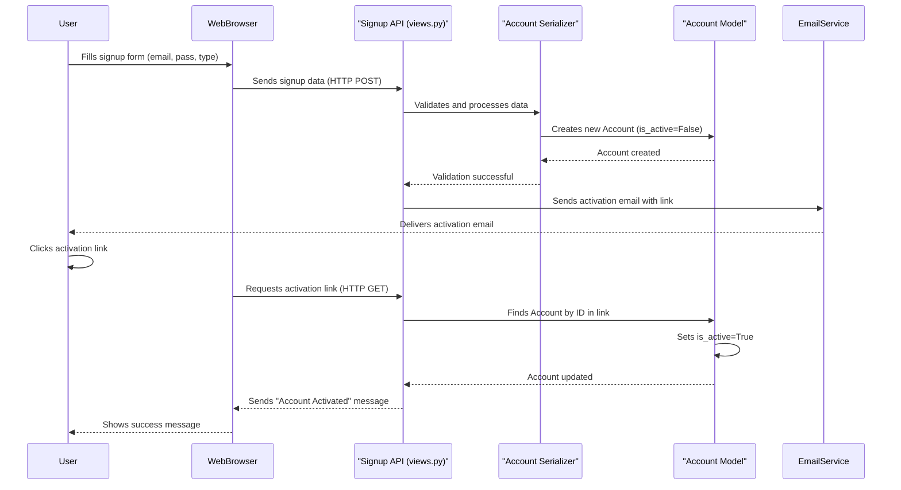

# Chapter 1: Account (User Management System)

Every big website or application needs to know who is using it. Think about your email, social media, or online shopping accounts. How do these platforms recognize you? How do they know what you're allowed to do? This is precisely the problem that the "Account" system in our project solves!

Imagine our project, `document_KT`, as a bustling marketplace. We'll have **Customers** who want to find services and **Dealers** who provide them. To keep things organized and secure, we need a way to identify each person uniquely. That's the main job of an "Account".

The `Account` is like your "master ID card" or "passport" for the entire platform. It holds your fundamental identity (like your email and name) and basic access rights. Without an Account, you can't really do much on the platform, just like you can't board an international flight without a passport!

Let's consider a common scenario: **A new customer wants to sign up for our platform.** How does this process work with the Account system?

### What is an Account?

At its simplest, an `Account` is a record that represents a unique user on our platform. It contains:

*   **Your Identity:** Your email address (which is unique to you) and your full name.
*   **Your Secret Key:** Your password, kept safe and secure.
*   **Your Role:** Are you a `Customer` or a `Dealer`? This helps the system know what features you should see and use.
*   **Status Information:** Is your account active? Are you logged in right now? Are you an administrator?

### Signing Up: Creating Your Master ID Card

When a new customer signs up, they're essentially asking the system to create their unique `Account`. Here's how it generally happens:

1.  **You provide your details:** You fill out a form with your email, full name, a password, and indicate that you're signing up as a 'Customer'.
2.  **The System Processes It:** Our system takes this information and creates a new `Account` record.
3.  **Activation Email:** To make sure it's really you, the system sends an activation link to your email.
4.  **You Activate:** You click the link in the email, and your `Account` becomes active, allowing you to log in.

Let's look at a simplified code example of how someone might send their signup details to our system (this is what happens when you click "Submit" on a signup form):

```python
# This is what your web browser might send to the system
signup_data = {
    "full_name": "Alice Wonderland",
    "email": "alice@example.com",
    "password": "strongpassword123",
    "password2": "strongpassword123", # Confirm password
    "account_type": "Customer",
    "profile_type": "Personal" # More details for the profile
}

# Imagine this data being sent to our system's signup "door"
# The system will then process it.
print("Sending signup data to the system...")
```
After receiving this data, our system will begin creating the `Account` for Alice.

### Under the Hood: Building Your Account

Let's peek behind the curtain to see how the "Account" system is built using Django, a popular web framework for Python.

#### 1. The Account Blueprint (`accounts/models.py`)

The most fundamental part of our Account system is the `Account` model. Think of this as the blueprint that defines what information every `Account` must have. It's defined in the `accounts/models.py` file.

```python
# Simplified from accounts/models.py

from django.db import models
from django.contrib.auth.models import AbstractBaseUser, PermissionsMixin

class MyAccountManager(models.BaseUserManager):
    # This part helps create users and superusers (admins)
    def create_user(self, full_name, email, password=None, **extra_fields):
        # Checks if email exists, normalizes it, and creates the user.
        # It securely stores the password (not shown here fully).
        # ... (full implementation is longer) ...
        pass

class Account(AbstractBaseUser, PermissionsMixin):
    account_type_choice =(
        ('Customer','Customer'),
        ('Dealer','Dealer'),
    )
    full_name = models.CharField(max_length=100)
    email = models.EmailField(max_length=100,unique=True)
    phone_number = models.CharField(max_length=13,null=True,blank=True)
    account_type = models.CharField(choices=account_type_choice,max_length=30,null=True,blank=True)
    
    # ... other fields like date_joined, is_active, is_staff, etc. ...
    
    USERNAME_FIELD = 'email' # We use email to log in
    REQUIRED_FIELDS = ['full_name'] # What's needed to create a user
    
    objects = MyAccountManager() # Our special helper for managing accounts
    
    def __str__(self):
        return self.email
```
In this code:
*   `Account` is our "blueprint." It inherits from `AbstractBaseUser` and `PermissionsMixin`, which gives it built-in features for user authentication and permissions.
*   `email` is set as `unique=True` because every user must have a different email address, just like every person has a unique passport number.
*   `account_type` uses `choices` to ensure an account can only be 'Customer' or 'Dealer'.
*   `MyAccountManager` is a special class that knows how to create new `Account` objects securely, especially handling passwords.

#### 2. The Account Manager (`MyAccountManager` in `accounts/models.py`)

The `MyAccountManager` handles the complex steps of creating new users and making sure their passwords are saved safely (not in plain text!). When we say `Account.objects.create_user(...)`, it's this manager that does the work. It's like the specialized construction crew that follows the `Account` blueprint to build a new account.

#### 3. Admin's Control Panel (`accounts/admin.py`)

For administrators of the platform, Django provides a powerful admin interface. The `AccountAdmin` class makes sure that administrators can easily view, create, and modify user accounts through this interface.

```python
# Simplified from accounts/admin.py

from django.contrib import admin
from .models import Account
from django.contrib.auth.admin import UserAdmin

@admin.register(Account)
class AccountAdmin(UserAdmin):
    model = Account
    list_display = ('email', 'full_name', 'account_role','account_type','is_staff', 'is_active',)
    list_filter = ('is_staff', 'is_active','email')
    fieldsets = (
        (None, {'fields': ('email', 'password')}),
        ('Personal Info', {'fields': ('full_name',)}),
        ('Permissions', {'fields': ('is_staff', 'is_active', 'is_superuser',)}),
    )
    # ... (other admin configurations) ...
```
This code tells Django how to display `Account` information in the admin panel, making it easy for platform administrators to manage users.

#### 4. The Signup "Door" (`accounts/views.py`)

When you sign up on the website, your details are sent to a special "door" in our system, known as an API endpoint. For signups, this is handled by the `SignupAPIView` in `accounts/views.py`.

```python
# Simplified from accounts/views.py

from rest_framework.views import APIView
from rest_framework.response import Response
from rest_framework import status
from .serializers import AccountSerializer
from .models import Account

class SignupAPIView(APIView):
    def post(self, request):
        email = request.data.get("email")
        if Account.objects.filter(email=email).first():
            return Response({"error": "User already exists"}, status=status.HTTP_400_BAD_REQUEST)
            
        serializer = AccountSerializer(data=request.data)
        if serializer.is_valid(raise_exception=True):
            user = serializer.save() # This creates the Account
            user.is_active = False # New accounts are inactive initially
            user.save()
            # ... (code to send activation email) ...
            return Response({"message": "Registration successful. Activation link sent."}, status=status.HTTP_201_CREATED)
        return Response(serializer.errors, status=status.HTTP_400_BAD_REQUEST)
```
This is the code that receives your signup data. It first checks if the email already exists. Then, it uses something called an `AccountSerializer` (explained next) to check your data and then saves your new `Account` to the database. Notice how `user.is_active = False` is set, meaning the account isn't ready to use until activated.

#### 5. The Data Translator (`accounts/serializers.py`)

Before saving your signup data, the system needs to make sure it's correct and safe. This is where `AccountSerializer` in `accounts/serializers.py` comes in. It acts like a strict validator and translator.

```python
# Simplified from accounts/serializers.py

from rest_framework import serializers
from .models import Account

class AccountSerializer(serializers.ModelSerializer):
    password2 = serializers.CharField(write_only=True) # For confirming password

    class Meta:
        model = Account
        fields = ['full_name', 'email', 'phone_number', 'password', 'password2', 'account_type']
        extra_kwargs = {'password': {'write_only': True}} # Don't show password in responses

    def validate(self, attrs):
        if attrs['password'] != attrs['password2']:
            raise serializers.ValidationError("Passwords do not match")
        return attrs

    def create(self, validated_data):
        # This calls the create_user method from MyAccountManager
        validated_data.pop('password2') # Remove password2 before creating
        # 'profile_type' is handled in the view logic, not directly by Account here
        validated_data.pop('profile_type') 
        return Account.objects.create_user(**validated_data)
```
The `AccountSerializer` ensures:
*   All required fields are present.
*   The email format is correct.
*   Crucially, `password` and `password2` (confirm password) match.
Once validated, it calls the `create_user` method of our `MyAccountManager` to safely create the `Account`.

#### 6. Account Activation Flow

After a user signs up, their `Account` is initially marked as `is_active = False`. This means they can't log in yet. The system then sends an activation email with a unique link. When the user clicks this link, it calls the `ActivateAccountAPIView` in `accounts/views.py`. This view checks the link's validity and, if everything is correct, sets `user.is_active = True`. Only then can the user log in. This is a common security measure to verify email addresses and prevent bots from creating fake accounts.

#### Sequence Diagram: How Signup Works

Let's visualize the steps when a user signs up and activates their account:



This diagram shows the journey from a user filling out a form to their account becoming active. Notice how `AccountSerializer` and `AccountModel` work together, and how the `SignupAPI` coordinates the process, including sending the activation email.

### Conclusion

In this chapter, we learned that the `Account` is the fundamental building block for identifying users in our `document_KT` project. It's like the "master ID card" holding essential details and determining basic access. We saw how new accounts are created through a signup process involving the `Account` model, a manager, a serializer for validation, and an activation step to ensure security.

However, an `Account` only provides basic information (email, name, role). What if we need more specific details for a `Customer` (like a profile picture) or a `Dealer` (like their business type)? That's where **User Profiles** come in, which we'll explore in the next chapter.

[User Profiles (Customer & Dealer)](02_user_profiles__customer___dealer__.md)

---

<sub><sup>Generated by [AI Codebase Knowledge Builder](https://github.com/The-Pocket/Tutorial-Codebase-Knowledge).</sup></sub> <sub><sup>**References**: [[1]](https://github.com/snehabansal483/document_KT/blob/d67e31b38bb840bb7638be252701f22660c34d80/accounts/admin.py), [[2]](https://github.com/snehabansal483/document_KT/blob/d67e31b38bb840bb7638be252701f22660c34d80/accounts/backends.py), [[3]](https://github.com/snehabansal483/document_KT/blob/d67e31b38bb840bb7638be252701f22660c34d80/accounts/migrations/0001_initial.py), [[4]](https://github.com/snehabansal483/document_KT/blob/d67e31b38bb840bb7638be252701f22660c34d80/accounts/models.py), [[5]](https://github.com/snehabansal483/document_KT/blob/d67e31b38bb840bb7638be252701f22660c34d80/accounts/serializers.py), [[6]](https://github.com/snehabansal483/document_KT/blob/d67e31b38bb840bb7638be252701f22660c34d80/accounts/views.py)</sup></sub>