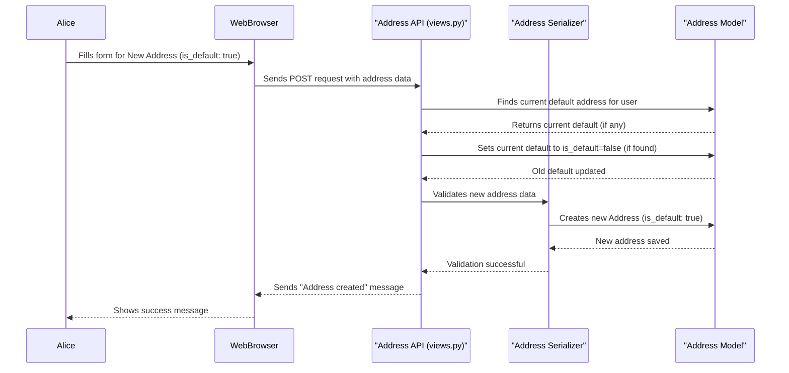

# Chapter 3: Address Management

In [Chapter 1: Account (User Management System)](01_account__user_management_system__.md), we established the `Account` as your digital identity card. Then, in [Chapter 2: User Profiles (Customer & Dealer)](02_user_profiles__customer___dealer__.md), we added specific "badges" like `CustomerProfile` or `DealerProfile` to store details unique to your role. But what about where you *are*?

Imagine you're an online shopper, or a business that needs to send or receive goods. Where do you live? Where is your office? How does the system know where to deliver your purchases or send important documents? This is exactly what **Address Management** handles in our `document_KT` project!

It's like having a "digital address book" connected to your account. You can store all your important locations – your home, your office, your vacation rental, or even a friend's address for a gift delivery. The system keeps track of them, and you can easily pick one as your main or "default" address.

### What is an Address?

In `document_KT`, an `Address` is a record that stores all the necessary information about a physical location. Each `Address` is linked to a specific `Account`, meaning every user can have one or more addresses saved under their name.

Here's what an `Address` typically contains:

| Field Name     | Description                                               | Example                         |
| :------------- | :-------------------------------------------------------- | :------------------------------ |
| `add_user`     | Which user (Account) does this address belong to?         | Alice's Account                 |
| `add_line1`    | The primary street address.                               | `123 Main Street`               |
| `add_line2`    | Optional, secondary address information (e.g., apartment).| `Apt 4B`                        |
| `landmark`     | A nearby recognizable place.                              | `Near City Park`                |
| `city`         | The city.                                                 | `Springfield`                   |
| `state`        | The state or province.                                    | `IL`                            |
| `country`      | The country.                                              | `USA`                           |
| `zipcode`      | The postal code.                                          | `62704`                         |
| `is_default`   | Is this the user's primary/default address? (Yes/No)      | `True`                          |

The `is_default` field is very handy! It means you can have several addresses, but one is always marked as the one you use most often. When you set a new address as default, any previous default address for your account automatically becomes non-default. This ensures you always have one main address.

### Use Case: Managing Your Addresses

Let's say Alice (our `Customer`) has moved homes. She needs to add her new address and set it as her default. She might also want to keep her old address in her account for a while, just in case.

Here’s how Alice might add her new address and set it as default:

1.  **Alice logs into her account.**
2.  **She goes to her "My Addresses" section.**
3.  **She clicks "Add New Address" and fills in the details.** She makes sure to tick the "Set as default" box for her new address.
4.  **She clicks "Save."**

The system will then:
*   Save her new address.
*   Automatically change her *previous* default address to be *not* default.
*   Mark her *new* address as the default one.

Alice can also edit an existing address or delete one she no longer needs.

Here’s a simplified example of the data Alice's web browser might send to the system to add a new default address:

```python
# This is what your web browser might send to the system
new_address_data = {
    "add_line1": "456 Elm Avenue",
    "add_line2": "",
    "landmark": "Next to the bookstore",
    "city": "Springfield",
    "state": "IL",
    "country": "USA",
    "zipcode": 62705,
    "is_default": True # This is important!
}

# Imagine this data being sent to our system's address "door"
print("Sending new default address data...")
```
When this data is received, the system processes it to store the address and manage the default flag.

### Under the Hood: Building Address Management

Let's see how the `Address` system is built and how it handles multiple addresses and the default feature.

#### 1. The Address Blueprint (`accounts/models.py`)

The core of our Address system is the `Address` model, defined in the `accounts/models.py` file. This is the blueprint for every address record.

```python
# Simplified from accounts/models.py

from django.db import models
from .models import Account # Assuming Account is defined earlier

class Address(models.Model):
    add_user = models.ForeignKey(Account, related_name='user_address', on_delete=models.CASCADE)
    add_line1 = models.CharField(max_length=200, verbose_name="Address Line 1")
    add_line2 = models.CharField(max_length=200, verbose_name="Address Line 2", blank=True)
    city = models.CharField(max_length=50, verbose_name="City")
    state = models.CharField(max_length=50, verbose_name="State")
    country = models.CharField(max_length=50, verbose_name="Country")
    zipcode = models.IntegerField(verbose_name="Zipcode")
    is_default = models.BooleanField(default=False, verbose_name="Default Address")
    
    def __str__(self):
        return f"{self.add_line1}, {self.city}"

    class Meta:
        verbose_name = "Address"
        verbose_name_plural = "Addresses"
```
In this code:
*   `add_user = models.ForeignKey(Account, ...)` is key. It creates a link from the `Address` back to the `Account` it belongs to. `ForeignKey` means one user can have many addresses. `on_delete=models.CASCADE` means if a user's `Account` is deleted, all their addresses are also deleted.
*   `is_default = models.BooleanField(default=False)` is the flag that tells us if this is the user's main address.

#### 2. Admin's Control Panel (`accounts/admin.py`)

Just like with `Account` and `Profile` models, Django's admin interface allows platform administrators to view and manage addresses easily.

```python
# Simplified from accounts/admin.py

from django.contrib import admin
from .models import Address

@admin.register(Address)
class AddressAdmin(admin.ModelAdmin):
    list_display = ('id', 'add_user', 'add_line1', 'city', 'zipcode', 'is_default')
    list_filter = ('city', 'state', 'country', 'is_default')
    search_fields = ('add_line1', 'city', 'zipcode', 'add_user__email')
```
This tells Django how to display addresses in the admin panel, making it simple to find addresses by user, city, or check which ones are set as default.

#### 3. The Data Translator (`accounts/serializers.py`)

When you add or update an address, the `AddressSerializer` in `accounts/serializers.py` acts as a validator and translator, ensuring the data is correct before it's saved to the database.

```python
# Simplified from accounts/serializers.py

from rest_framework import serializers
from .models import Address

class AddressSerializer(serializers.ModelSerializer):
    class Meta:
        model = Address
        fields = [
            'id', 'add_user', 'add_line1', 'add_line2', 'landmark', 'city',
            'state', 'country', 'zipcode', 'is_default'
        ]
        read_only_fields = ['add_user', 'id'] # User ID and address ID are set by system

    def validate(self, attrs):
        # Ensure that the user adding/updating the address is authenticated
        if not self.context.get('add_user'):
            raise serializers.ValidationError("User login required.")
        return attrs

    def create(self, validated_data):
        # Link the address to the authenticated user
        add_user = self.context.get('add_user')
        return Address.objects.create(add_user=add_user, **validated_data)

    def update(self, instance, validated_data):
        # Update existing fields
        for field in ['add_line1', 'add_line2', 'landmark', 'city', 'state', 'country', 'zipcode', 'is_default']:
            setattr(instance, field, validated_data.get(field, getattr(instance, field)))
        instance.save()
        return instance
```
The `AddressSerializer` makes sure all required address fields are present and correctly formatted. The `read_only_fields` prevent users from directly changing the `add_user` or `id`. The `create` and `update` methods save the data, linking it to the logged-in user.

#### 4. The Address "Doors" (`accounts/views.py`)

When you interact with your addresses (adding, viewing, updating, deleting), your requests go to the `AddressAPIView` in `accounts/views.py`. This view handles the main logic for all address operations.

```python
# Simplified from accounts/views.py

from rest_framework.views import APIView
from rest_framework.response import Response
from rest_framework.permissions import IsAuthenticated
from .models import Address
from .serializers import AddressSerializer
from rest_framework import status

class AddressAPIView(APIView):
    permission_classes = [IsAuthenticated] # Only logged-in users can manage addresses

    def get(self, request, *args, **kwargs):
        # Get all addresses for the logged-in user
        addresses = Address.objects.filter(add_user=request.user)
        serializer = AddressSerializer(addresses, many=True) # `many=True` for multiple addresses
        return Response(serializer.data, status=status.HTTP_200_OK)

    def post(self, request, *args, **kwargs):
        user_instance = request.user
        is_default = request.data.get('is_default', False)

        if is_default:
            # If new address is default, make old defaults non-default
            Address.objects.filter(add_user=user_instance, is_default=True).update(is_default=False)

        serializer = AddressSerializer(data=request.data, context={'add_user': user_instance})
        if serializer.is_valid(raise_exception=True):
            serializer.save() # This creates the new address
            return Response({"message": "Address created successfully."}, status=status.HTTP_201_CREATED)
        return Response(serializer.errors, status=status.HTTP_400_BAD_REQUEST)

    def put(self, request, id, *args, **kwargs): # `id` is the address ID to update
        user_instance = request.user
        try:
            address = Address.objects.get(id=id, add_user=user_instance) # Find the specific address
        except Address.DoesNotExist:
            return Response({"error": "Address not found."}, status=status.HTTP_404_NOT_NOT_FOUND)

        is_default = request.data.get('is_default', False)
        if is_default:
            # If updating to default, make other addresses non-default
            Address.objects.filter(add_user=user_instance, is_default=True).exclude(id=address.id).update(is_default=False)

        serializer = AddressSerializer(address, data=request.data, partial=True, context={'add_user': user_instance})
        if serializer.is_valid(raise_exception=True):
            serializer.save() # This updates the address
            return Response({"message": "Address updated successfully."}, status=status.HTTP_200_OK)
        return Response(serializer.errors, status=status.HTTP_400_BAD_REQUEST)

    def delete(self, request, id, *args, **kwargs): # `id` is the address ID to delete
        try:
            address = Address.objects.get(id=id, add_user=request.user)
            address.delete()
            return Response({"message": "Address deleted successfully."}, status=status.HTTP_204_NO_CONTENT)
        except Address.DoesNotExist:
            return Response({"error": "Address not found."}, status=status.HTTP_404_NOT_FOUND)
```
This `AddressAPIView` is powerful!
*   `get`: Allows a user to fetch all their saved addresses.
*   `post`: Creates a new address. Notice the logic: if the new address is marked `is_default=True`, it first finds any *other* addresses for that user that were default and switches their `is_default` to `False`. This ensures only one default address exists per user.
*   `put`: Updates an existing address. It also contains logic to manage the `is_default` flag similar to `post`.
*   `delete`: Removes an address from the user's account.

#### Sequence Diagram: Adding a New Default Address

Let's visualize the steps when Alice adds a new address and sets it as her default:


This diagram shows how the system carefully manages the `is_default` flag to ensure a smooth user experience where only one address is primary at any given time.

### Conclusion

Address Management is crucial for any platform that deals with physical locations. In `document_KT`, we use the `Address` model to store location details, linked directly to user accounts. The system allows users to store multiple addresses and designates one as their `is_default`, with automatic handling to ensure consistency. This organized approach ensures that delivery and service information is always accurate and easy to manage for both customers and dealers.

Now that we understand how accounts, profiles, and addresses are managed, the next logical step is to explore how users securely gain access to these features.

[Authentication Backend](04_authentication_backend_.md)

---

<sub><sup>Generated by [AI Codebase Knowledge Builder](https://github.com/The-Pocket/Tutorial-Codebase-Knowledge).</sup></sub> <sub><sup>**References**: [[1]](https://github.com/snehabansal483/document_KT/blob/d67e31b38bb840bb7638be252701f22660c34d80/accounts/admin.py), [[2]](https://github.com/snehabansal483/document_KT/blob/d67e31b38bb840bb7638be252701f22660c34d80/accounts/migrations/0001_initial.py), [[3]](https://github.com/snehabansal483/document_KT/blob/d67e31b38bb840bb7638be252701f22660c34d80/accounts/migrations/0002_address_digipin.py), [[4]](https://github.com/snehabansal483/document_KT/blob/d67e31b38bb840bb7638be252701f22660c34d80/accounts/migrations/0003_remove_address_digipin.py), [[5]](https://github.com/snehabansal483/document_KT/blob/d67e31b38bb840bb7638be252701f22660c34d80/accounts/migrations/0004_address_digipin_code.py), [[6]](https://github.com/snehabansal483/document_KT/blob/d67e31b38bb840bb7638be252701f22660c34d80/accounts/migrations/0005_remove_address_digipin_code_address_digipin.py), [[7]](https://github.com/snehabansal483/document_KT/blob/d67e31b38bb840bb7638be252701f22660c34d80/accounts/migrations/0006_remove_address_digipin.py), [[8]](https://github.com/snehabansal483/document_KT/blob/d67e31b38bb840bb7638be252701f22660c34d80/accounts/models.py), [[9]](https://github.com/snehabansal483/document_KT/blob/d67e31b38bb840bb7638be252701f22660c34d80/accounts/serializers.py), [[10]](https://github.com/snehabansal483/document_KT/blob/d67e31b38bb840bb7638be252701f22660c34d80/accounts/views.py)</sup></sub>