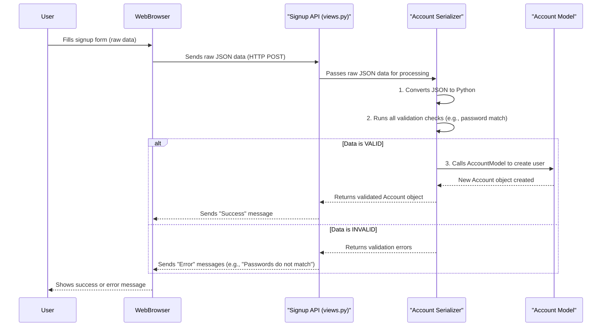

# Chapter 6: Data Serializers

In [Chapter 5: API Endpoints & Views](05_api_endpoints___views__.md), we learned that our `document_KT` system has specific "doorways" (API Endpoints) and "receptionists" (Views) that allow other applications (like your phone app) to talk to it. When your app sends information (like your signup details) or asks for information (like your profile picture), it uses a common language like **JSON**.

But our `document_KT` project, being built with Python and Django, works internally with **Python objects**. These are things like `Account` objects, `CustomerProfile` objects, or `Address` objects – the "blueprints" we discussed in Chapters 1, 2, and 3.

Here's the problem: A Python object and a piece of JSON data speak different "languages"! You can't just send a `CustomerProfile` object directly over the internet to a phone app, nor can you directly save raw JSON data from an app into your database as a Python object.

This is exactly the problem that **Data Serializers** solve!

Think of Serializers as the "translators" or "customs officers" of our `document_KT` system. They have two main jobs:

1.  **Translating Outgoing Data (Python to JSON/XML):** When our system needs to send data (like your profile details) to your app, the serializer takes the complex Python object and converts it into a universally understandable format, like JSON. It's like translating an internal memo into a public announcement.
2.  **Translating Incoming Data (JSON/XML to Python) and Validating It:** When your app sends data (like your new profile picture), the serializer takes the incoming JSON, converts it into a Python format that our system can understand, and, very importantly, **validates** it. Validation means checking if the data is complete, in the correct format, and safe to use. It's like a customs officer checking your passport and luggage before letting you into the country.

Without serializers, our API endpoints wouldn't be able to "understand" what external apps are sending, nor would they be able to send back information in a way those apps can use.

### Use Case: Signing Up (Again!)

Let's revisit the signup process from [Chapter 1: Account (User Management System)](01_account__user_management_system__.md) and [Chapter 5: API Endpoints & Views](05_api_endpoints___views__.md), but this time, let's focus on the Serializer's role.

When you fill out the signup form on a website or app, you enter details like your full name, email, and password. This data is then sent to our `/register/` API endpoint.

**Input (from your web browser/app, sent as JSON):**

```json
{
    "full_name": "Alice Wonderland",
    "email": "alice@example.com",
    "password": "mysecretpassword",
    "password2": "mysecretpassword",
    "account_type": "Customer",
    "profile_type": "Personal"
}
```

When our `SignupAPIView` (the "receptionist" for signups) receives this raw JSON data, it doesn't immediately know if `alice@example.com` is a valid email, if the passwords match, or if `Customer` is an allowed `account_type`. This is where the `AccountSerializer` steps in!

The serializer's job is to:
1.  Take this raw JSON.
2.  Turn it into Python data.
3.  Check all the rules (e.g., "email must be unique", "passwords must match", "account_type must be 'Customer' or 'Dealer'").
4.  If everything is good, it converts the data into a Python object that can be safely saved to our database.
5.  If something is wrong, it tells the `SignupAPIView` exactly what the errors are, so the API can send back a helpful error message to your app.

**Output (from the serializer, if successful):**
Validated Python data, ready to create a new `Account` object in our database.

```python
# Internally, the serializer prepares something like this
# for our Account model to be created:
validated_account_data = {
    "full_name": "Alice Wonderland",
    "email": "alice@example.com",
    "password": "securely_hashed_password", # Password gets hashed
    "account_type": "Customer"
}
```
If there were errors, the output would be a dictionary of error messages.

### Under the Hood: Building a Data Serializer

Let's look at how our `AccountSerializer` is built in `accounts/serializers.py` and how it performs its translation and validation magic.

#### 1. The Serializer Blueprint (`accounts/serializers.py`)

Just like we have "blueprints" (models) for our `Account`, `CustomerProfile`, and `Address` objects, we have "serializer blueprints" that tell Django REST Framework how to handle data for these models.

Here's a simplified version of `AccountSerializer`:

```python
# Simplified from accounts/serializers.py

from rest_framework import serializers
from .models import Account # We need our Account model blueprint

class AccountSerializer(serializers.ModelSerializer):
    # This field is for checking password, not for saving to the Account model
    password2 = serializers.CharField(write_only=True) 
    
    class Meta:
        # This tells the serializer which model it's connected to
        model = Account
        # These are the fields the serializer will handle (read from/write to)
        fields = [
            'full_name', 
            'email', 
            'password', 
            'password2', # For input, not saved to model directly
            'account_type'
        ]
        # 'password' should only be written (sent by user), never read (sent back)
        extra_kwargs = {'password': {'write_only': True}} 

    # This method runs *before* data is saved, to check rules
    def validate(self, attrs):
        # Rule 1: Check if password and password2 match
        if attrs['password'] != attrs['password2']:
            raise serializers.ValidationError("Passwords do not match")
        return attrs # If all good, return the data

    # This method defines how to create a new Account object once data is validated
    def create(self, validated_data):
        # We don't need 'password2' anymore after validation, so we remove it
        validated_data.pop('password2') 
        # This calls a special method on our Account model (MyAccountManager)
        # to safely create the user, including securely hashing the password.
        return Account.objects.create_user(**validated_data)

# Other serializers (like for CustomerProfile, DealerProfile, Address)
# work in a similar way, defining fields, validations, and create/update logic.
```
In this code:
*   `class AccountSerializer(serializers.ModelSerializer):` This is a super handy class from Django REST Framework. It automatically creates serializer fields that match your Django model fields, saving a lot of typing!
*   `password2 = serializers.CharField(write_only=True)`: This is a custom field that doesn't exist in our `Account` model. It's just there for the input, specifically to confirm the password. `write_only=True` means this field will only be accepted when data is coming *into* the serializer, never sent *out*.
*   `class Meta`: This nested class is crucial. It tells `ModelSerializer` which `model` (e.g., `Account`) it should work with and which `fields` from that model it should include. `extra_kwargs` allows us to add special rules for fields, like `password` being `write_only` for security.
*   `validate(self, attrs)`: This is where our custom validation rules live. Here, we enforce that `password` and `password2` must be identical. If they're not, it raises a `ValidationError`, which tells the API endpoint that something is wrong.
*   `create(self, validated_data)`: After all validations pass, this method is called. It takes the `validated_data` (data that passed all checks) and uses it to create a new `Account` object in our database. Notice `validated_data.pop('password2')` to remove `password2` because our `Account` model doesn't have a `password2` field.

#### 2. How Views Use Serializers (`accounts/views.py`)

Now, let's see how our `SignupAPIView` (the "receptionist") uses this `AccountSerializer`:

```python
# Simplified from accounts/views.py - part of SignupAPIView
from rest_framework.views import APIView
from rest_framework.response import Response
from rest_framework import status
from .serializers import AccountSerializer # We import our serializer
from .models import Account

class SignupAPIView(APIView):
    def post(self, request):
        email = request.data.get("email")
        # Check if email already exists (important check done before serializer)
        if Account.objects.filter(email=email).first():
            return Response({"error": "User already exists"}, status=status.HTTP_400_BAD_REQUEST)
            
        # 1. Create a serializer instance with the incoming data (deserialization)
        serializer = AccountSerializer(data=request.data) 
        
        # 2. Ask the serializer to validate the data
        if serializer.is_valid(raise_exception=True): 
            # 3. If valid, tell the serializer to save the data (calls serializer's create method)
            user = serializer.save() 
            user.is_active = False # New accounts are inactive initially
            user.save()
            # ... (code to send activation email and create profile, as seen in Chapter 1 & 2) ...
            return Response({"message": "Registration successful. Activation link sent."}, status=status.HTTP_201_CREATED)
        # If not valid, serializer.errors contains the issues, and we return them
        return Response(serializer.errors, status=status.HTTP_400_BAD_REQUEST)
```
As you can see, the `SignupAPIView` relies heavily on the `AccountSerializer` for:
*   `serializer = AccountSerializer(data=request.data)`: This initializes the serializer with the raw incoming data.
*   `serializer.is_valid(raise_exception=True)`: This is the magical line that triggers all the validation rules defined in the serializer's `Meta` class and `validate()` methods. If anything is wrong, it immediately stops and raises an error.
*   `user = serializer.save()`: If the data is valid, this line calls the `create()` (or `update()`) method within the serializer, which then interacts with our `Account` model to create the new user record in the database.

#### Sequence Diagram: Serializer in the Signup Flow

Let's visualize the role of the serializer during a user signup:


This diagram clearly shows the serializer as the gatekeeper and translator in the middle, ensuring only correct and safe data enters our system.

### Types of Serializer Operations

| Operation     | Direction                          | Purpose                                     | Example                                            |
| :------------ | :--------------------------------- | :------------------------------------------ | :------------------------------------------------- |
| **Serialization** | Python Object -> JSON/XML String | Prepare internal data for external consumption | Sending `CustomerProfile` to display on app        |
| **Deserialization** | JSON/XML String -> Python Data | Process incoming data from external sources | Receiving `signup_data` from a form                |
| **Validation**  | (Part of Deserialization)        | Check data for correctness and security     | Ensuring passwords match, email format is correct  |
| **Saving**      | (Part of Deserialization)        | Create/Update Model Instance in Database    | Saving a new `Account` or updating an `Address`    |

### Conclusion

Data Serializers are the unsung heroes of our `document_KT` project's API. They act as indispensable "translators" and "customs officers," ensuring that data flowing into and out of our system is always in the correct format and has passed all necessary validation checks. By simplifying complex Python objects into universal formats (like JSON) and vice-versa, they enable seamless communication between our backend and external applications.

Now that we understand how data is managed, structured, and communicated, the next chapter will explore some useful utilities that help our project perform tasks like sending emails and generating QR codes.

[Email & QR Code Utilities](07_email___qr_code_utilities__.md)

---

<sub><sup>Generated by [AI Codebase Knowledge Builder](https://github.com/The-Pocket/Tutorial-Codebase-Knowledge).</sup></sub> <sub><sup>**References**: [[1]](https://github.com/snehabansal483/document_KT/blob/d67e31b38bb840bb7638be252701f22660c34d80/accounts/serializers.py), [[2]](https://github.com/snehabansal483/document_KT/blob/d67e31b38bb840bb7638be252701f22660c34d80/accounts/views.py)</sup></sub>