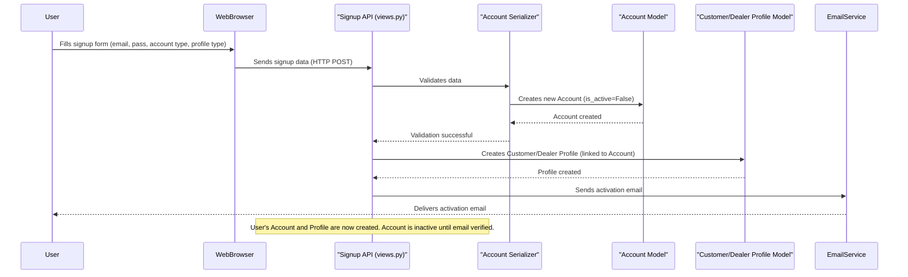

# Chapter 2: User Profiles (Customer & Dealer)

In [Chapter 1: Account (User Management System)](01_account__user_management_system__.md), we learned that an `Account` is like your "master ID card" for the `document_KT` platform. It holds your basic identity (email, name) and tells the system if you're a `Customer` or a `Dealer`. But what if we need more specific details?

Imagine you're signing up as a `Customer` on an online shopping site. Beyond your basic account, you might want to add a profile picture, or mark your profile as "personal" or for an "organization." Or, if you're a `Dealer` (like a business selling goods), you might need to specify if you're a 'Kabadi' (scrap dealer), a 'Collector', or a 'Recycler'.

This is where **User Profiles** come in! User Profiles are like "role-specific badges" that attach extra, specialized information to your basic `Account`. They help define your particular role and store data unique to that role within the system.

### What are User Profiles?

In `document_KT`, we have two main types of specialized profiles:

1.  **CustomerProfile:** This badge is for `Customer` accounts. It holds information that's only relevant to customers.
2.  **DealerProfile:** This badge is for `Dealer` accounts. It holds information specific to different types of dealers.

Think of it this way: Your `Account` is your name and basic ID. Your `CustomerProfile` or `DealerProfile` is like having a specific job title or a special membership card that gives you additional features and identifies your specific type of activity on the platform.

Each profile is uniquely linked to one `Account`. So, one `Account` can only have *either* a `CustomerProfile` *or* a `DealerProfile`, never both.

Let's look at the key details these profiles store:

| Feature      | CustomerProfile                                      | DealerProfile                                      |
| :----------- | :--------------------------------------------------- | :------------------------------------------------- |
| **KT ID**    | `kt_id` (e.g., `KTCP100001` for Personal Customer) | `kt_id` (e.g., `KTDK100001` for Kabadi Dealer)     |
| **Profile Type** | `Personal` or `Organization`                         | `Kabadi`, `Collector`, or `Recycler`               |
| **Profile Pic**| Stores an image for the user's profile picture       | Stores an image for the dealer's profile picture   |
| **QR Code**  | An auto-generated QR code linked to the `kt_id`      | An auto-generated QR code linked to the `kt_id`    |

The `kt_id` is especially important as it's a unique identifier specific to our `document_KT` system, giving each customer or dealer a distinct ID beyond their email.

### Use Case: A User Signs Up and Creates a Profile

When you sign up as a `Customer` or `Dealer` (as we saw in Chapter 1), our system doesn't just create your basic `Account`. It also automatically creates the correct profile (`CustomerProfile` or `DealerProfile`) for you and links it to your `Account`.

Let's say Alice (a `Customer`) and Bob (a `Dealer`) sign up:

1.  **Alice signs up as a 'Customer' with 'Personal' profile type.**
    *   The system creates her `Account` (from Chapter 1).
    *   Then, it automatically creates a `CustomerProfile` for her, linked to her `Account`, and sets her `profile_type` to 'Personal'. It also generates her `kt_id` and `qrCode`.

2.  **Bob signs up as a 'Dealer' with 'Kabadi' profile type.**
    *   The system creates his `Account`.
    *   Then, it automatically creates a `DealerProfile` for him, linked to his `Account`, and sets his `profile_type` to 'Kabadi'. It also generates his `kt_id` and `qrCode`.

After signup, users can also update their profile details, like adding or changing their `ProfilePic`.

Here's how you might send data to update a customer's profile picture:

```python
# This is what your web browser might send to the system
# Imagine 'new_profile_pic.jpg' is an image file
profile_data = {
    "ProfilePic": "new_profile_pic.jpg"
}

# This data would be sent to an API endpoint like /api/customer/profile/
print("Sending profile picture update data...")
```
When this data is received, the system updates Alice's `CustomerProfile` with the new image.

### Under the Hood: Building User Profiles

Let's look at how these profiles are structured and managed within our Django project.

#### 1. The Profile Blueprints (`accounts/models.py`)

Just like the `Account` model, we have blueprints for `CustomerProfile` and `DealerProfile` in `accounts/models.py`.

```python
# Simplified from accounts/models.py
from django.db import models
from .models import Account # Assuming Account is defined earlier

class CustomerProfile(models.Model):
    profile_type_choice = (
        ('Personal', 'Personal'),
        ('Organization', 'Organization'),
    )
    kt_id = models.CharField(max_length=20, editable=False)
    profile_type = models.CharField(max_length=20, choices=profile_type_choice, default='Personal')
    auth_id = models.OneToOneField(Account, on_delete=models.CASCADE, verbose_name="User")
    ProfilePic = models.ImageField(upload_to='media/accounts/Customer/')
    qrCode = models.ImageField(default = 'cvm_qrcodes/4.jpg', upload_to='media/accounts/Customer/QRs')

    def save(self, *args, **kwargs):
        # Logic to auto-generate kt_id based on profile_type
        if not self.kt_id or self.kt_id == 'KT':
            prefix = "KTCP" if self.profile_type == "Personal" else "KTCO"
            self.kt_id = f"{prefix}{100000 + CustomerProfile.objects.count() + 1}"
        super().save(*args, **kwargs)

class DealerProfile(models.Model):
    profile_type_choice = (
        ('Kabadi', 'Kabadi'),
        ('Collector', 'Collector'),
        ('Recycler', 'Recycler'),
    )
    kt_id = models.CharField(max_length=20, editable=False)
    profile_type = models.CharField(max_length=20, choices=profile_type_choice, default='Kabadi')
    auth_id = models.OneToOneField(Account,on_delete=models.CASCADE,null=True)
    qrCode = models.ImageField(default = 'cvm_qrcodes/4.jpg', upload_to='accounts/Dealer/QRs')
    ProfilePic = models.ImageField(default = 'photos/Profile_Pic.png', upload_to='accounts/Dealer/ProfilePic', null = True, blank = True)

    def save(self, *args, **kwargs):
        # Logic to auto-generate kt_id based on profile_type
        if not self.kt_id or self.kt_id == 'KT':
            if self.profile_type == "Kabadi": prefix = "KTDK"
            elif self.profile_type == "Collector": prefix = "KTDC"
            else: prefix = "KTDR"
            self.kt_id = f"{prefix}{100000 + DealerProfile.objects.count() + 1}"
        super().save(*args, **kwargs)
```
In these blueprints:
*   `auth_id = models.OneToOneField(Account, ...)` is crucial. It means each profile is directly and exclusively linked to one `Account`, and vice-versa. If the `Account` is deleted, the profile is also deleted (`on_delete=models.CASCADE`).
*   `kt_id` is `editable=False`, meaning the system generates it automatically when the profile is saved.
*   `profile_type` uses `choices` to ensure only specific types can be selected.
*   `ProfilePic` and `qrCode` are fields for image files.
*   The `save()` method contains logic to automatically generate the `kt_id` based on the `profile_type`.

#### 2. Admin's View (`accounts/admin.py`)

Administrators can easily manage these profiles through Django's admin interface:

```python
# Simplified from accounts/admin.py
from django.contrib import admin
from .models import CustomerProfile, DealerProfile

@admin.register(CustomerProfile)
class CustomerProfileAdmin(admin.ModelAdmin):
    list_display = ('id', 'auth_id','ProfilePic','qrCode')
    list_filter = ('auth_id','profile_type')

@admin.register(DealerProfile)
class DealerProfileAdmin(admin.ModelAdmin):
    list_display = ('id', 'auth_id','ProfilePic','qrCode')
    list_filter = ('profile_type',)
```
This code tells Django how to display `CustomerProfile` and `DealerProfile` records in the admin panel, making it easy to search and filter them.

#### 3. The Data Translators (`accounts/serializers.py`)

When data comes into or goes out of our system for profiles, it needs to be validated and formatted. `CustomerProfileSerializer` and `DealerProfileSerializer` handle this.

```python
# Simplified from accounts/serializers.py
from rest_framework import serializers
from .models import CustomerProfile, DealerProfile

class CustomerProfileSerializer(serializers.ModelSerializer):
    class Meta:
        model = CustomerProfile
        fields = ['ProfilePic'] # Only ProfilePic is directly settable via API
        read_only_fields = ['qrCode'] # qrCode is auto-generated

    def validate(self, attrs):
        # Ensures that only a 'Customer' account can create/update this profile
        user = self.context['auth_id']
        if user.account_type != 'Customer':
            raise serializers.ValidationError("Only Customers can manage CustomerProfile.")
        return attrs

    def create(self, validated_data):
        auth_id = self.context.get('auth_id')
        return CustomerProfile.objects.create(auth_id=auth_id, **validated_data)

class DealerProfileSerializer(serializers.ModelSerializer):
    class Meta:
        model = DealerProfile
        fields = ['ProfilePic']
        read_only_fields = ['auth_id'] # auth_id should not be directly editable
        # 'qrCode' and 'kt_id' are also read-only, but often implicit or set in views

    def validate(self, attrs):
        # Ensures that only a 'Dealer' account can create/update this profile
        user = self.context['auth_id']
        if user.account_type != 'Dealer':
            raise serializers.ValidationError("Only Dealers can manage DealerProfile.")
        return attrs

    def create(self, validated_data):
        auth_id = self.context['auth_id']
        validated_data['auth_id'] = auth_id
        return DealerProfile.objects.create(**validated_data)
```
These serializers define which fields can be sent or received. They also include `validate` methods to ensure that, for example, a `CustomerProfile` is only created or updated by an actual `Customer` account. The `create` method links the profile to the correct authenticated user (`auth_id`).

#### 4. The Profile "Doors" (`accounts/views.py`)

When you interact with profiles through the website or app, your requests go to specific API endpoints, handled by views in `accounts/views.py`.

**Creating Profiles During Signup:**
As mentioned, the initial creation of `CustomerProfile` or `DealerProfile` happens right after the `Account` is created in the `SignupAPIView` from Chapter 1.

```python
# Simplified from accounts/views.py - part of SignupAPIView
class SignupAPIView(APIView):
    def post(self, request):
        # ... (email, password validation as in Chapter 1) ...
        if serializer.is_valid(raise_exception=True):
            user = serializer.save() # This creates the Account
            user.is_active = False
            # ... (send activation email) ...

            account_type = request.data.get("account_type")
            profile_type = request.data.get("profile_type")

            if account_type == 'Customer':
                CustomerProfile.objects.get_or_create(auth_id=user, defaults={"profile_type": profile_type})
            else: # account_type == 'Dealer'
                DealerProfile.objects.get_or_create(auth_id=user, defaults={"profile_type": profile_type})

            return Response({"message": "Registration successful..."}, status=status.HTTP_201_CREATED)
        # ... (error handling) ...
```
This snippet shows how the `SignupAPIView` checks the `account_type` and `profile_type` from the signup data and then either creates a `CustomerProfile` or `DealerProfile`, linking it to the newly created `user` (Account).

**Viewing and Updating Profiles:**
Separate API views exist for logged-in users to `GET` (retrieve) their profile information or `PUT` (update) parts of it, like a profile picture.

```python
# Simplified from accounts/views.py
from rest_framework.views import APIView
from rest_framework.response import Response
from rest_framework.permissions import IsAuthenticated
from .models import CustomerProfile, DealerProfile
from .serializers import CustomerProfileSerializer, DealerProfileSerializer
from rest_framework.parsers import MultiPartParser, FormParser

class CustomerProfileAPIView(APIView):
    permission_classes = [IsAuthenticated]
    parser_classes = [MultiPartParser, FormParser] # Allows sending files like images

    def get(self, request):
        try:
            # Get the customer profile linked to the currently logged-in user
            customer_profile = CustomerProfile.objects.get(auth_id=request.user)
            serializer = CustomerProfileSerializer(customer_profile)
            return Response(serializer.data, status=status.HTTP_200_OK)
        except CustomerProfile.DoesNotExist:
            return Response({"error": "Customer profile not found"}, status=status.HTTP_404_NOT_FOUND)

    def put(self, request):
        try:
            customer_profile = CustomerProfile.objects.get(auth_id=request.user)
            # Update the profile with data from the request
            serializer = CustomerProfileSerializer(
                customer_profile, data=request.data, partial=True, context={'auth_id': request.user}
            )
            if serializer.is_valid(raise_exception=True):
                serializer.save()
                return Response({"message": "Customer profile updated successfully"}, status=status.HTTP_200_OK)
            return Response(serializer.errors, status=status.HTTP_400_BAD_REQUEST)
        except CustomerProfile.DoesNotExist:
            return Response({"error": "Customer profile not found"}, status=status.HTTP_404_NOT_FOUND)

# DealerProfileAPIView would be similar, but for DealerProfile model and serializer
```
This `CustomerProfileAPIView` allows a logged-in `Customer` to retrieve their profile details (`GET`) and update their `ProfilePic` (`PUT`). The `MultiPartParser` and `FormParser` are necessary to handle image file uploads.

#### Sequence Diagram: Profile Creation during Signup

Let's visualize how the `Account` and its related `Profile` are created when a user signs up:



This diagram illustrates the integrated process where a new user's `Account` and their specific `CustomerProfile` or `DealerProfile` are both set up during the initial signup flow.

### Conclusion

User Profiles are essential for adding specific details beyond a user's basic `Account`. By having `CustomerProfile` and `DealerProfile` models, our `document_KT` project can store unique information like `kt_id`, `profile_type`, `ProfilePic`, and `qrCode` for different user types. This modular approach keeps our data organized and ensures that each user's experience is tailored to their specific role.

Now that we understand how user accounts and profiles are managed, the next step is to explore how to handle their physical locations.

[Address Management](03_address_management_.md)

---

<sub><sup>Generated by [AI Codebase Knowledge Builder](https://github.com/The-Pocket/Tutorial-Codebase-Knowledge).</sup></sub> <sub><sup>**References**: [[1]](https://github.com/snehabansal483/document_KT/blob/d67e31b38bb840bb7638be252701f22660c34d80/accounts/admin.py), [[2]](https://github.com/snehabansal483/document_KT/blob/d67e31b38bb840bb7638be252701f22660c34d80/accounts/migrations/0001_initial.py), [[3]](https://github.com/snehabansal483/document_KT/blob/d67e31b38bb840bb7638be252701f22660c34d80/accounts/models.py), [[4]](https://github.com/snehabansal483/document_KT/blob/d67e31b38bb840bb7638be252701f22660c34d80/accounts/serializers.py), [[5]](https://github.com/snehabansal483/document_KT/blob/d67e31b38bb840bb7638be252701f22660c34d80/accounts/views.py)</sup></sub>