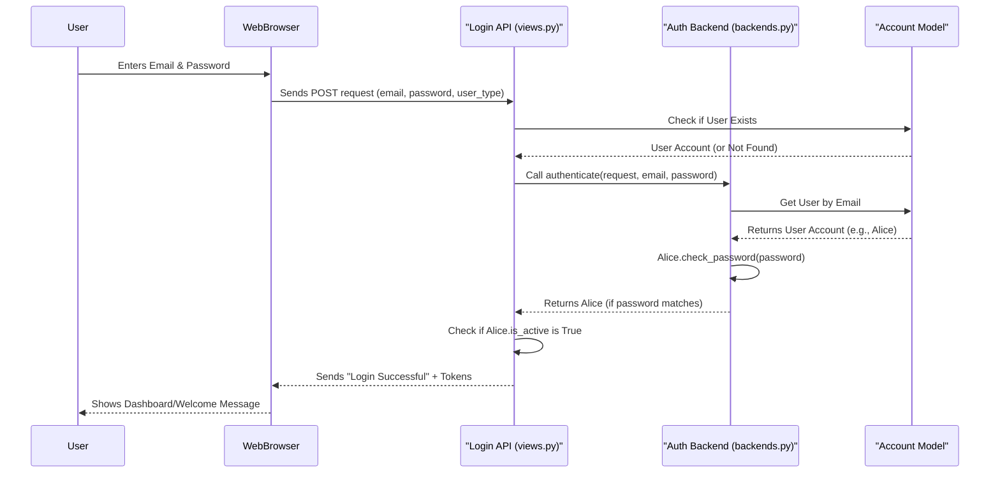

# Chapter 4: Authentication Backend

In [Chapter 1: Account (User Management System)](01_account__user_management_system__.md), we learned about your "master ID card" – your `Account`. [Chapter 2: User Profiles (Customer & Dealer)](02_user_profiles__customer___dealer__.md) added specific "badges" for customers and dealers. And [Chapter 3: Address Management](03_address_management_.md) showed how to manage your locations. But there's a crucial question: How does our `document_KT` project know that the person trying to access all this information is *really* you?

Imagine you have a secret diary. You wouldn't leave it open for just anyone to read, right? You'd have a lock and key. Similarly, our `document_KT` platform needs a way to confirm your identity before letting you in to manage your account, profile, or addresses. This is exactly what the **Authentication Backend** does!

It's the "security guard" at the login gate. When you try to log in, it's the Authentication Backend's job to verify your identity. It takes the email and password you provide and checks them against the records stored in our system. If they match, it gives you the "all clear" to enter.

### What is an Authentication Backend?

In simple terms, an Authentication Backend is a set of rules and logic that tells our application *how* to verify a user's identity.

For our `document_KT` project, this component is specially configured to:

*   **Authenticate by Email:** Instead of a generic username, it uses your unique email address as your primary identifier.
*   **Verify Password:** It securely checks if the password you entered matches the one stored for your email.
*   **Grant Access:** If both match, it confirms your identity and lets you into your account.

Think of it as a highly trained security professional who knows exactly how to check your ID (email) and secret handshake (password) to ensure you're a valid member of the club.

### Use Case: Logging In to Your Account

Let's walk through the most common scenario: You want to log in to your `document_KT` account.

1.  **You open the `document_KT` website/app.**
2.  **You see a login screen** and type in your registered email and your password.
3.  **You click "Log In."**

Behind the scenes, the Authentication Backend springs into action. It takes your email and password, compares them with what's stored for your `Account` (from Chapter 1), and if they are correct, you're granted access! You'll then be able to see your customer or dealer profile, manage your addresses, and use all the features of the platform.

Here's how you might send your login details to the system:

```python
# This is what your web browser might send to the system
login_data = {
    "email": "alice@example.com",
    "password": "strongpassword123",
    "user_type": "Customer" # Or "Dealer"
}

# Imagine this data being sent to our system's login "door"
print("Sending login data to the system...")
```

If everything is correct, the system will send back a success message, along with special "tokens" that act like your temporary access pass for future actions on the site.

### Under the Hood: How Login Works

Let's peek behind the curtain to see how `document_KT` handles your login attempt.

#### 1. The Login "Door" (`accounts/views.py`)

When you click "Log In," your web browser sends your email and password to a specific "door" in our system, which is handled by the `LoginAccount` class in `accounts/views.py`.

```python
# Simplified from accounts/views.py - LoginAccount class
from django.contrib.auth import authenticate # The key helper!
from rest_framework.views import APIView
from rest_framework.response import Response
from rest_framework import status
from .models import Account # Our Account blueprint

class LoginAccount(APIView):
    def post(self, request):
        email = request.data.get("email")
        password = request.data.get("password")
        user_type = request.data.get("user_type")

        # 1. Does a user with this email exist?
        try:
            user = Account.objects.get(email=email)
        except Account.DoesNotExist:
            return Response({"message": "User doesn't exist"}, status=status.HTTP_401_UNAUTHORIZED)
        
        # 2. Is the user type correct?
        if user.account_type != user_type:
            return Response({"error": "Invalid user type."}, status=status.HTTP_401_UNAUTHORIZED)

        # 3. Ask the Authentication Backend to check credentials
        user = authenticate(request, email=email, password=password)
        
        if user is None:
            return Response({"error": "Invalid email or password."}, status=status.HTTP_401_UNAUTHORIZED)

        # 4. Is the account active? (From Chapter 1)
        if not user.is_active:
            # Code to send activation email again
            return Response({"error": "Account not activated. Check email."}, status=status.HTTP_403_FORBIDDEN)

        # 5. If all checks pass, generate tokens and log in!
        # token = get_tokens_for_user(user) # Generates temporary access pass
        # ... (further processing and response with tokens) ...
        return Response({"message": "You have been logged in."}, status=status.HTTP_200_OK)
```

In this code:
*   The `LoginAccount` view first gets the email and password you entered.
*   It performs some initial checks, like confirming the user exists and the `user_type` matches.
*   The most important line for authentication is `user = authenticate(request, email=email, password=password)`. This is like telling the "security guard" to do its job.
*   If `authenticate` returns a valid `user`, it means the security check passed! Otherwise, it's `None`, meaning the login failed.
*   Finally, it checks if the account is `is_active` (remember from Chapter 1, accounts need activation). If everything is good, you're logged in and receive your access tokens.

#### 2. The Real Security Guard (`accounts/backends.py`)

The `authenticate` function (which we just saw in `views.py`) doesn't do the checking itself. Instead, it delegates this job to our custom **Authentication Backend**. This backend is defined in `accounts/backends.py`.

```python
# Simplified from accounts/backends.py
from django.contrib.auth.backends import BaseBackend
from .models import Account # Our Account blueprint

class EmailUsernameAuthBackend(BaseBackend):
    # This method is called by authenticate()
    def authenticate(self, request, email=None, password=None, **kwargs):
        try:
            # 1. Find the user by their email
            user = Account.objects.get(email=email)
        except Account.DoesNotExist:
            # User with this email not found
            return None

        # 2. Check if the provided password matches the stored one
        if user.check_password(password):
            # Password matches! Return the user object.
            return user
        # Password doesn't match
        return None

    # This method helps the system get a user by their ID
    def get_user(self, user_id):
        try:
            return Account.objects.get(pk=user_id)
        except Account.DoesNotExist:
            return None
```

In this code:
*   `EmailUsernameAuthBackend` is our custom security guard. It inherits from `BaseBackend`, which is Django's standard way to create these.
*   The `authenticate` method is where the core logic happens:
    *   It tries to find an `Account` using the `email` provided.
    *   If found, it uses `user.check_password(password)` to securely compare the entered password with the one stored. This function is super important because it doesn't compare plain text passwords; it compares their secure "hashed" versions.
    *   If both match, it proudly returns the `user` object, signaling a successful login. Otherwise, it returns `None`.
*   The `get_user` method is a helper that lets the system retrieve a user object later, typically when a user is already logged in (e.g., to keep them logged in across different pages).

#### How the Pieces Fit Together: The Login Flow

Let's visualize the journey of your login attempt:



This diagram shows how your login request travels through different parts of the system, with the `Authentication Backend` doing the critical job of verifying your identity.

### Other Authentication Features

Beyond basic login, the Authentication Backend (and related parts of `accounts/views.py`) also powers other important security features:

*   **Account Activation:** As seen in [Chapter 1](01_account__user_management_system__.md), when you sign up, an activation link is sent to your email. Clicking this link uses a special token to verify your email and set your `Account` to `is_active=True`, allowing you to log in.
*   **Password Reset:** If you forget your password, you can request a password reset. The system sends you a link with a temporary token. This process also uses the Authentication Backend's logic indirectly to verify the token and allow you to set a new password.
*   **Logout:** When you log out, your current session is ended, and your temporary access tokens are invalidated, ensuring that no one can continue using your account.

These features all work together with the core Authentication Backend to keep your `document_KT` account secure.

### Conclusion

The **Authentication Backend** is the unsung hero of user security in our `document_KT` project. It's the dedicated "security guard" that meticulously checks your identity (email and password) every time you try to log in. By using a custom backend, our system focuses on email-based authentication and ensures that only legitimate users can access their accounts, profiles, and addresses.

Now that we understand how users securely log in, the next step is to explore how all these different "doors" (APIs and views) are organized and made available for the web or mobile applications to talk to.

[API Endpoints & Views](05_api_endpoints___views_.md)

---

<sub><sup>Generated by [AI Codebase Knowledge Builder](https://github.com/The-Pocket/Tutorial-Codebase-Knowledge).</sup></sub> <sub><sup>**References**: [[1]](https://github.com/snehabansal483/document_KT/blob/d67e31b38bb840bb7638be252701f22660c34d80/accounts/backends.py), [[2]](https://github.com/snehabansal483/document_KT/blob/d67e31b38bb840bb7638be252701f22660c34d80/accounts/views.py)</sup></sub>