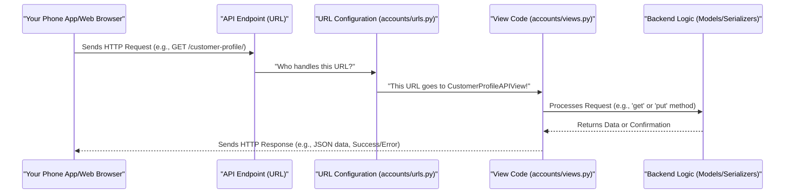

# Chapter 5: API Endpoints & Views

In [Chapter 4: Authentication Backend](04_authentication_backend_.md), we explored the "security guard" that ensures only you can log into your `document_KT` account. But once you're logged in, how does your phone app or web browser actually *talk* to our `document_KT` system to fetch your profile, add an address, or perform any other action?

Imagine our `document_KT` project, which lives on a server somewhere, as a big, bustling office building. Inside, we have all the important departments: the "Account" department (Chapter 1), the "User Profiles" department (Chapter 2), and the "Address Management" department (Chapter 3).

Your phone app or web browser is like a visitor outside this building. It needs a way to request information or send new instructions to these departments. It can't just walk straight into the "Account" department's vault!

This is where **API Endpoints & Views** come in. They are the public-facing "doorways" or "reception desks" of our `document_KT` building. They are specifically designed for *other applications* (like your phone app, a website, or even another computer program) to interact with our backend system.

Think of each API Endpoint as a specific "service window" or "form submission point" in the building. For instance, there's one window for "Signing Up," another for "Logging In," one for "Viewing Your Profile," and so on. Each window (endpoint) has a specific job.

### What are API Endpoints and Views?

Let's break down these two terms:

1.  **API (Application Programming Interface):** At its core, an API is just a set of rules and tools that allows different software applications to communicate with each other. It's like a universal language for programs.
2.  **Endpoint:** This is a specific web address (URL) where an API can be accessed. It's the exact "doorway" for a particular action.
    *   Examples for `document_KT`: `/register`, `/login`, `/customer-profile`, `/address`.
    *   When your app wants to sign up a user, it sends data to the `/register` endpoint.
3.  **View (in Django REST Framework):** This is the actual Python code behind the endpoint. If the endpoint is the "doorway," the view is the "receptionist" or "worker" who stands behind that doorway.
    *   The view receives incoming requests (e.g., "A new user wants to sign up!").
    *   It processes the request (e.g., "Okay, check their details, create an account").
    *   It retrieves or updates data in our system (e.g., talks to the `Account` model).
    *   It sends back a structured response (e.g., "User signed up successfully!" or "Error: Email already taken"), typically in **JSON** format, which is a common way for applications to exchange data.

#### How Do They Communicate? HTTP Methods

When your app talks to an endpoint, it uses different "HTTP Methods" to tell the view what kind of action it wants to perform. Think of these as different types of requests you can make at a reception desk:

| HTTP Method | What it means                       | Analogy at a Reception Desk |
| :---------- | :---------------------------------- | :-------------------------- |
| **GET**     | I want to **GET** (read/retrieve) data. | "Can I have my profile details?" |
| **POST**    | I want to **POST** (create) new data. | "Here's my signup form."    |
| **PUT**     | I want to **PUT** (update) existing data, completely replacing it. | "Here's my updated profile, replace everything." |
| **PATCH**   | I want to **PATCH** (update) existing data, changing only a few things. | "Just change my profile picture." |
| **DELETE**  | I want to **DELETE** data.          | "Please remove this address." |

Our `document_KT` project uses these methods extensively for all interactions.

### Use Case: Getting and Updating Your Customer Profile

Let's say Alice (our `Customer` from Chapter 1 and 2) wants to do two things:
1.  See her current customer profile details (like her `kt_id` or `ProfilePic`).
2.  Update her profile picture.

How does her phone app accomplish this using API Endpoints and Views?

#### 1. Getting Your Profile Details (HTTP GET)

Her phone app would send a **GET** request to the `/customer-profile/` endpoint.

**Request (from phone app):**
(The app just needs to know who is logged in, which is handled by a special "token" it sends, but no extra data is needed for `GET`.)

```
GET /api/customer-profile/
```

**Expected Response (from `document_KT` system):**

```json
{
    "kt_id": "KTCP100001",
    "profile_type": "Personal",
    "ProfilePic": "http://example.com/media/accounts/Customer/alice_profile.jpg"
}
```
The app receives this JSON data and can then display Alice's profile on her screen.

#### 2. Updating Your Profile Picture (HTTP PUT)

Now, Alice wants to change her profile picture. Her phone app would send a **PUT** request to the *same* `/customer-profile/` endpoint, but this time, it includes the new image file.

**Request (from phone app):**

```python
# The phone app sends this data, including the image file
# This is usually sent as 'form-data' because it includes a file
update_data = {
    "ProfilePic": <new_image_file.jpg>
}

# The app sends this to:
# PUT /api/customer-profile/
print("Sending new profile picture to the system...")
```

**Expected Response (from `document_KT` system):**

```json
{
    "message": "Customer profile updated successfully"
}
```
The system processes the new image, updates Alice's `CustomerProfile` in the database, and sends back a success message.

### Under the Hood: The Inner Workings

Let's trace how these requests travel through our `document_KT` system.

#### The Journey of a Request

When your app sends a request to an API Endpoint, here's the simplified path it takes:



This diagram shows that the URL configuration acts like a "map" that directs the incoming request from the Endpoint to the correct View code that knows how to handle it. The View then talks to other parts of the system (like models and serializers) to do the actual work.

#### 1. The URL Map (`accounts/urls.py`)

Every API endpoint needs an entry in our project's URL map. This map tells Django which "View" (Python code) should run when a specific URL is accessed. These are defined in `accounts/urls.py`.

```python
# Simplified from accounts/urls.py
from django.urls import path
from .views import SignupAPIView, LoginAccount, CustomerProfileAPIView, AddressAPIView # Import our views

urlpatterns = [
    # This maps /register/ to our SignupAPIView
    path('register/', SignupAPIView.as_view(), name = "registration"),
    # This maps /login/ to our LoginAccount view
    path('login/',LoginAccount.as_view(),name='login_account'),
    # This maps /customer-profile/ to our CustomerProfileAPIView
    path('customer-profile/', CustomerProfileAPIView.as_view(), name='customer-profile'),
    # This maps /address/ and /address/<id>/ to our AddressAPIView
    path('address/', AddressAPIView.as_view(), name='address'),
    path('address/<int:id>/', AddressAPIView.as_view(), name='address'),
    # ... other URL patterns
]
```
Each `path()` line creates an endpoint. For example, `path('customer-profile/', CustomerProfileAPIView.as_view(), ...)` means when a request comes to `/customer-profile/`, Django will send it to the `CustomerProfileAPIView`. The `.as_view()` part is a special way Django REST Framework uses to turn the view class into something that can handle web requests.

#### 2. The View Code (`accounts/views.py`)

This is where the "receptionist" logic lives. Each API View is a Python class that inherits from `APIView` (or similar). Inside these classes, we define methods (functions) for `get`, `post`, `put`, `delete` – one for each HTTP method the endpoint should handle.

Let's look at a simplified `CustomerProfileAPIView` from `accounts/views.py`:

```python
# Simplified from accounts/views.py
from rest_framework.views import APIView
from rest_framework.response import Response
from rest_framework.permissions import IsAuthenticated
from .models import CustomerProfile # Our CustomerProfile blueprint
from .serializers import CustomerProfileSerializer # Our data translator
from rest_framework.parsers import MultiPartParser, FormParser # For handling files

class CustomerProfileAPIView(APIView):
    # Only logged-in users can access this (permission_classes)
    permission_classes = [IsAuthenticated]
    # Allows receiving files like images (parser_classes)
    parser_classes = [MultiPartParser, FormParser]

    def get(self, request, *args, **kwargs):
        # When an app sends a GET request to /customer-profile/
        try:
            # 1. Find the customer profile linked to the logged-in user
            customer_profile = CustomerProfile.objects.get(auth_id=request.user)
            # 2. Use a serializer to turn the profile data into JSON
            serializer = CustomerProfileSerializer(customer_profile)
            # 3. Send back the JSON data with a success status
            return Response(serializer.data, status=status.HTTP_200_OK)
        except CustomerProfile.DoesNotExist:
            return Response({"error": "Customer profile not found"}, status=status.HTTP_404_NOT_FOUND)

    def put(self, request, *args, **kwargs):
        # When an app sends a PUT request to /customer-profile/
        try:
            # 1. Find the customer profile to update
            customer_profile = CustomerProfile.objects.get(auth_id=request.user)
        except CustomerProfile.DoesNotExist:
            return Response({"error": "Customer profile not found"}, status=status.HTTP_404_NOT_FOUND)

        # 2. Use a serializer to validate and update the profile with incoming data
        serializer = CustomerProfileSerializer(
            customer_profile, data=request.data, partial=True, context={'auth_id': request.user}
        )
        # 3. If data is valid, save it
        if serializer.is_valid(raise_exception=True):
            serializer.save() # This updates the CustomerProfile in the database
            # 4. Send back a success message
            return Response({"message": "Customer profile updated successfully"}, status=status.HTTP_200_OK)
        # If data is not valid, send back errors
        return Response(serializer.errors, status=status.HTTP_400_BAD_REQUEST)
```
In this simplified example:
*   `permission_classes = [IsAuthenticated]` ensures only users who are logged in (authenticated) can use this endpoint. This links directly to [Chapter 4: Authentication Backend](04_authentication_backend_.md).
*   `parser_classes = [MultiPartParser, FormParser]` is needed because we're expecting an image file (`ProfilePic`) in the incoming data.
*   The `get` method handles requests to retrieve (GET) the profile. It fetches the `CustomerProfile` linked to the logged-in user (`request.user`) and uses the `CustomerProfileSerializer` to convert it into JSON data for the response.
*   The `put` method handles requests to update (PUT) the profile. It takes the incoming data (`request.data`), updates the existing `customer_profile`, and then saves it via the serializer.

Notice how the views use `request.user` (from the authenticated session), `request.data` (the incoming information from the app), and `Response()` (to send back information). They also heavily rely on **Serializers** (like `CustomerProfileSerializer`) to make sure the data is correct and formatted properly.

We also saw `SignupAPIView` and `LoginAccount` in previous chapters. These are also examples of API Views, each acting as a "doorway" for their specific functionality (user registration and login, respectively).

### Conclusion

API Endpoints & Views are the vital communication layer of our `document_KT` project. They are the public "doorways" (`/register`, `/customer-profile`, etc.) that allow external applications (like your phone app) to interact with our system. The "views" are the Python code that receives these requests, processes them using backend logic (like talking to models and using serializers), and sends back structured responses, typically in JSON. By understanding how these endpoints and views operate, you grasp how `document_KT` communicates with the outside world.

Speaking of Serializers, you might have noticed they played a big role in the views above. In the next chapter, we'll dive deeper into what these "data translators and validators" are and how they help ensure data is always in the correct format.

[Data Serializers](06_data_serializers_.md)

---

<sub><sup>Generated by [AI Codebase Knowledge Builder](https://github.com/The-Pocket/Tutorial-Codebase-Knowledge).</sup></sub> <sub><sup>**References**: [[1]](https://github.com/snehabansal483/document_KT/blob/d67e31b38bb840bb7638be252701f22660c34d80/accounts/urls.py), [[2]](https://github.com/snehabansal483/document_KT/blob/d67e31b38bb840bb7638be252701f22660c34d80/accounts/views.py)</sup></sub>