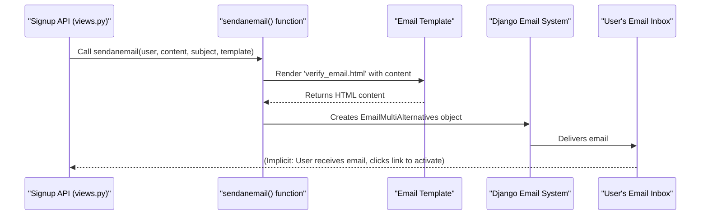
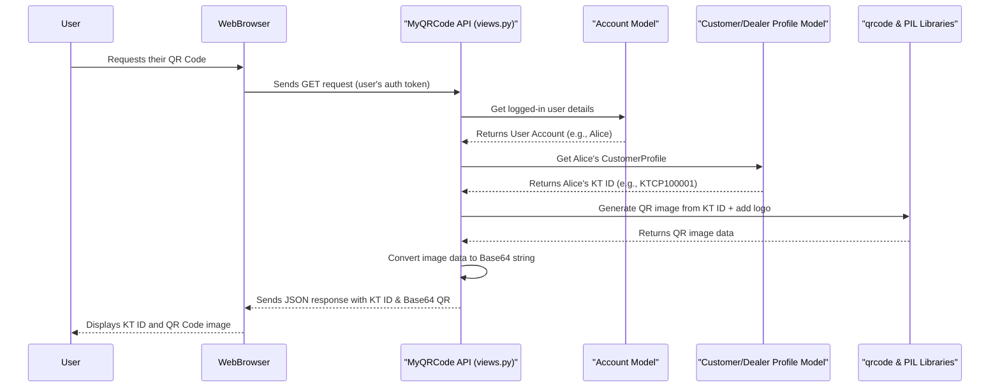

# Chapter 7: Email & QR Code Utilities

In our `document_KT` project, we've built the core pieces: your "master ID card" with [Chapter 1: Account (User Management System)](01_account__user_management_system__.md), your "role-specific badges" in [Chapter 2: User Profiles (Customer & Dealer)](02_user_profiles__customer___dealer__.md), and your "digital address book" in [Chapter 3: Address Management](03_address_management_.md). We also saw how you securely log in using the [Chapter 4: Authentication Backend](04_authentication_backend_.md) and how our system communicates via [Chapter 5: API Endpoints & Views](05_api_endpoints___views__.md) using "translators" called [Chapter 6: Data Serializers](06_data_serializers_.md).

But what about common tasks that cut across many parts of our system? Like sending a "Welcome!" email when a new user signs up, or sending a link to reset a forgotten password? Or, how about creating a scannable image that uniquely identifies a user's KT ID for quick lookups?

This is where **Email & QR Code Utilities** come in!

These are like specialized "helper toolkits" within our system. Instead of writing the same email-sending code or QR code-generating code over and over again in different places, we have dedicated modules (tools) that do these specific jobs. They provide reusable functionalities, making our code cleaner, more efficient, and easier to manage.

Think of them as:
*   **Email Utility:** Our project's "Mail Room" – where all outgoing emails are professionally prepared and sent.
*   **QR Code Utility:** Our project's "Special Printer" – which can quickly create unique scannable images for identification.

### Use Case: Activating an Account & Getting Your QR ID

Let's recall the signup process from [Chapter 1](01_account__user_management_system__.md). When a new user (like Alice) signs up, her account is initially `inactive`. To verify her email and activate her account, an activation link is sent to her email. This is a job for the **Email Utility**.

Once Alice's account is active and she has a [Chapter 2: User Profile](02_user_profiles__customer___dealer__.md) with a unique KT ID (e.g., `KTCP100001`), she might want a quick way to share or display that ID. A **QR Code Utility** can generate a scannable image linked to her KT ID, making it easy for others to scan and identify her.

Let's explore how these utilities work in `document_KT`.

### The Email Utility: Sending Messages

Our `document_KT` project needs to send various emails:
*   **Account Activation:** To verify a user's email address.
*   **Password Reset:** If a user forgets their password.
*   **Notifications:** For important updates or alerts.

The `sendanemail` function is our go-to tool for this. It's designed to be flexible, allowing us to send plain text or beautifully formatted HTML emails using templates.

#### How It's Used (Example: Sending an Activation Email)

When Alice signs up via the `SignupAPIView` (our "signup door" from [Chapter 5](05_api_endpoints___views__.md)), after her basic account is created, the system uses `sendanemail` to send her the activation link.

```python
# Simplified from accounts/views.py - inside SignupAPIView
# ... after user is created and user.is_active = False ...

# 1. Prepare the unique activation link
token_generator = PasswordResetTokenGenerator()
token = token_generator.make_token(user)
uid = urlsafe_base64_encode(force_bytes(user.pk))
activation_link = f"{current_site_frontend}/email-verify/{uid}/{token}/"

# 2. Prepare the content for the email template
content = {"site": activation_link}

# 3. Call our email utility function!
# It will send an email with the subject "Activate Your Account"
# using the 'verify_email.html' template and the 'content' data.
sendanemail(request, user=user, content=content, subject="Activate Your Account", template='verify_email.html')

# Expected output: An email is sent to Alice's email address.
# Alice clicks the link to activate her account.
```
This single line `sendanemail(...)` handles all the complexity of preparing and sending the email.

#### Under the Hood: The Email Utility's Mail Room

The core logic for sending emails resides in the `sendanemail` function within `accounts/views.py`. It uses Django's built-in email capabilities.

```python
# Simplified from accounts/views.py

from django.core.mail import EmailMultiAlternatives # For rich emails
from django.template.loader import render_to_string # To use HTML templates
from django.utils.html import strip_tags # To create plain text from HTML
from django.conf import settings # To get email sender from settings

def sendanemail(request, user, content, subject, template=None):
    # 1. Render the HTML content from a template (e.g., 'verify_email.html')
    if template:
        html_content = render_to_string(template_name=template, context=content)
    else:
        # Fallback if no specific template is given
        html_content = render_to_string('verify_email.html', context=content)

    # 2. Create a plain text version of the email (for older email clients)
    text_content = strip_tags(html_content)

    # 3. Create an Email object
    email = EmailMultiAlternatives(
        subject,
        text_content,
        settings.EMAIL_HOST_USER, # Our email sender address
        [user.email] # The recipient's email address
    )
    # 4. Attach the HTML version
    email.attach_alternative(html_content, "text/html")

    # 5. Send the email!
    email.send()
```
This function is our robust "mail room manager." It takes the user, the email's content, and subject, decides whether to use a specific template, then prepares both HTML and plain text versions of the email, and finally sends it using Django's powerful `EmailMultiAlternatives` class.

There's also a simpler `Util.send_email` in `accounts/utils.py` which uses `EmailMessage` for basic text emails. The `sendanemail` function in `views.py` is generally preferred for its ability to handle HTML templates.

#### Sequence Diagram: Sending an Account Activation Email



### The QR Code Utility: Generating Scannable IDs

QR codes are fantastic for quick identification. In `document_KT`, each user's profile has a unique KT ID (e.g., `KTCP100001`). A QR code linked to this ID makes it easy to share and scan. Our QR Code Utility handles the creation and management of these images.

#### How It's Used (Example: Fetching Your QR Code)

Imagine Alice wants to see her KT ID QR code on her phone. She would open her profile, and the app would make a request to an API endpoint designed to retrieve QR codes.

```python
# Simplified from accounts/views.py - inside MyQRCode API View
from rest_framework.views import APIView
from rest_framework.response import Response
from rest_framework.permissions import IsAuthenticated
import qrcode
from PIL import Image # For image manipulation
import io
import base64
from django.conf import settings

class MyQRCode(APIView):
    permission_classes = [IsAuthenticated] # Only logged-in users can ask for their QR

    def get(self, request):
        user = request.user
        kt_id = None
        # 1. Get the user's KT ID from their profile (Customer or Dealer)
        try:
            if user.account_type == "Customer":
                kt_id = user.customerprofile.kt_id
            elif user.account_type == "Dealer":
                kt_id = user.dealerprofile.kt_id
            # ... error handling for profile not found ...
        except Exception as e:
            return Response({"error": "Profile not found or incomplete."}, status=status.HTTP_404_NOT_FOUND)

        # 2. Generate the QR code image
        QRcode1 = qrcode.QRCode(error_correction=qrcode.constants.ERROR_CORRECT_H)
        QRcode1.add_data(f"KT ID: {kt_id}")
        QRcode1.make()
        QRimg1 = QRcode1.make_image(fill_color='black', back_color='white').convert('RGB')

        # 3. (Optional) Add a logo to the center of the QR code
        logo_path = f"{settings.MEDIA_ROOT}/cvm_qrcodes/logo.png"
        logo = Image.open(logo_path)
        # ... resize logo and paste onto QRimg1 ...

        # 4. Convert the image to a base64 string so it can be sent over the internet
        buffer = io.BytesIO()
        QRimg1.save(buffer, format="JPEG")
        qr_code_base64 = base64.b64encode(buffer.getvalue()).decode('utf-8')
        buffer.close()

        # Expected output (JSON):
        # {
        #     "kt_id": "KTCP100001",
        #     "qr_code": "data:image/jpeg;base64,xxxxxxxxxxxx..."
        # }
        return Response({"kt_id": kt_id, "qr_code": qr_code_base64}, status=status.HTTP_200_OK)
```

The `MyQRCode` API view uses the `qrcode` library to generate the QR code based on the user's `kt_id`. It then uses `PIL (Pillow)` to potentially add a logo to the center of the QR code, and finally converts the image into a `base64` string. This string can be directly embedded and displayed by a web page or mobile app without needing to save it as a separate file.

There's also a function `convert_text_to_qrcode_customer` in `accounts/utils.py` that specifically saves the generated QR code to a file on the server. While not directly called from the current signup flow in the provided code (the `qrCode` field has a default image), this utility *could* be used to create and save a unique QR code image for a user's profile when it's first created or updated.

```python
# Simplified from accounts/utils.py

import qrcode
from PIL import Image
from django.conf import settings

def convert_text_to_qrcode_customer(text, filename, request):
    # This function creates a QR code image and saves it to a file.
    Logo_link = f"{settings.MEDIA_ROOT}/cvm_qrcodes/logo.png"
    logo = Image.open(Logo_link)
    # ... (code to resize logo) ...

    QRcode1 = qrcode.QRCode(error_correction=qrcode.constants.ERROR_CORRECT_H)
    data = text # The text to encode (e.g., "KT ID: KTCP100001")
    QRcode1.add_data(data)
    QRcode1.make()

    QRimg1 = QRcode1.make_image(fill_color='Black', back_color="white").convert('RGB')
    # ... (code to paste logo onto QRimg1) ...

    # Save the QR code image to a specific path
    QRimg1.save(f"{settings.MEDIA_ROOT}/accounts/customer/QRs/{filename}.jpg")

    # Return paths or URLs if needed
    qr_code_image_path = f"/accounts/customer/QRs/{filename}.jpg"
    return qr_code_image_path, # ... and other URL info
```
This utility function is useful when you need to store the QR code as a file on the server, perhaps to link it directly to a user's `ProfilePic` field, or to generate it offline.

#### Sequence Diagram: Fetching a User's QR Code



### Conclusion

Email & QR Code Utilities are powerful helper modules in our `document_KT` project. They act as "specialized toolkits" for common, cross-cutting tasks. The Email Utility (like `sendanemail`) ensures we can reliably send various types of emails (activation, password reset, notifications) using templates. The QR Code Utility (like the `MyQRCode` API view and `convert_text_to_qrcode_customer` function) provides ways to generate unique, scannable QR codes linked to user profiles, enhancing user interaction and identification. By centralizing these functionalities, we keep our code organized and maintainable.

This chapter concludes our deep dive into the core components of the `document_KT` project, from user accounts and profiles to addresses, authentication, API communication, data handling, and essential utilities. You now have a comprehensive understanding of how `document_KT` is structured and operates.

---

<sub><sup>Generated by [AI Codebase Knowledge Builder](https://github.com/The-Pocket/Tutorial-Codebase-Knowledge).</sup></sub> <sub><sup>**References**: [[1]](https://github.com/snehabansal483/document_KT/blob/d67e31b38bb840bb7638be252701f22660c34d80/accounts/utils.py), [[2]](https://github.com/snehabansal483/document_KT/blob/d67e31b38bb840bb7638be252701f22660c34d80/accounts/views.py)</sup></sub>